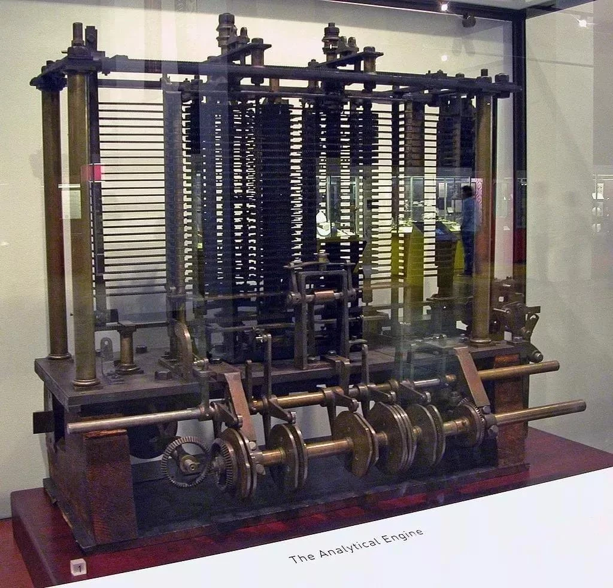
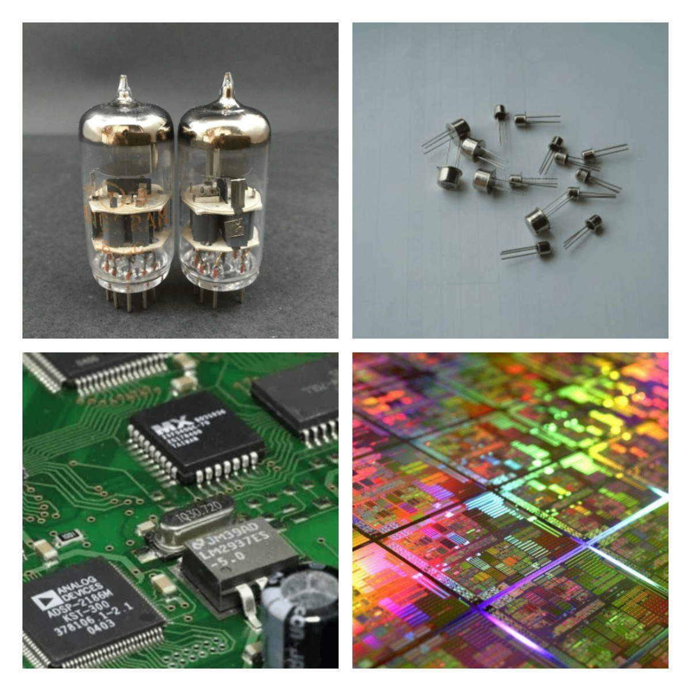
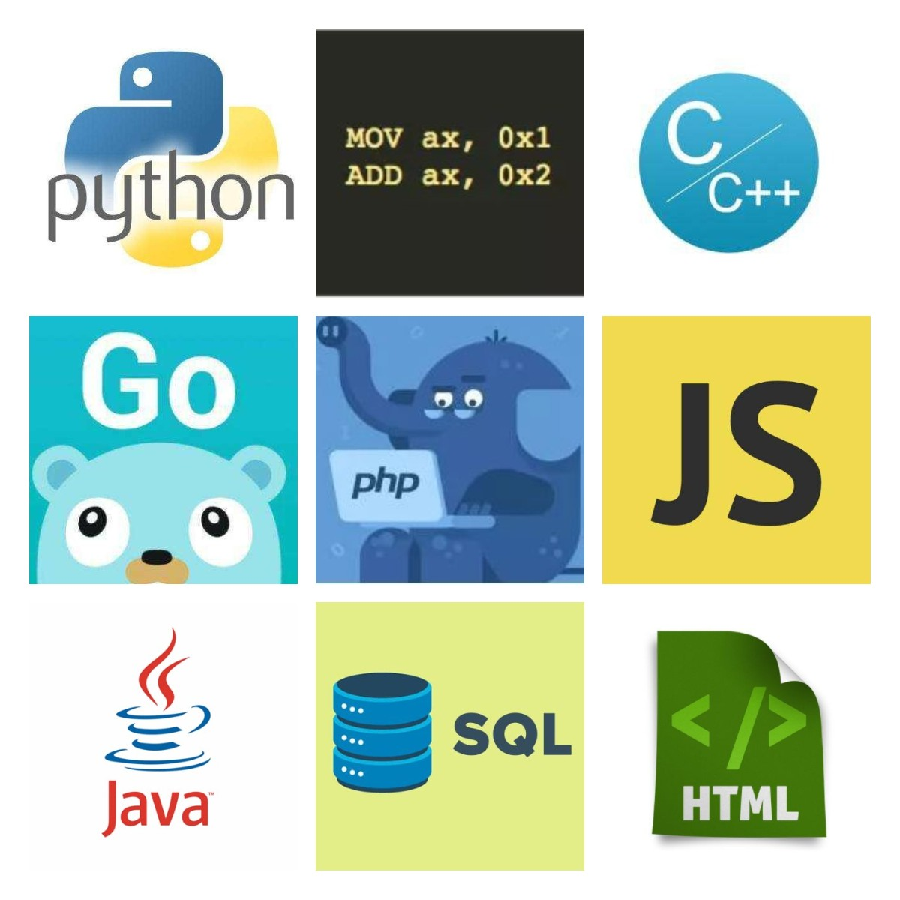
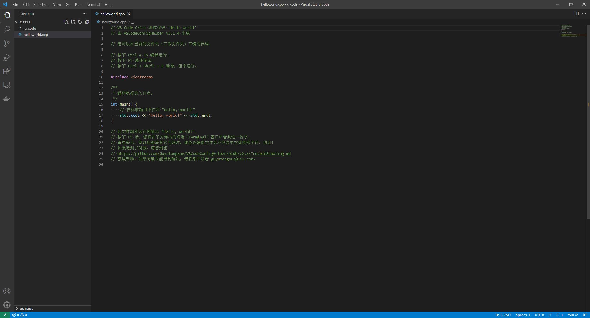

1.C语言学习前的准备
=========================

1.1.计算机发展简史
-------------------------

1.1.1计算机发展史上的巨人
~~~~~~~~~~~~~~~~~~~~~~~~~

1.1.1.1.查尔斯.巴贝奇
^^^^^^^^^^^^^^^^^^^^^^^^^

在计算机发展史上,差分机和分析机占有重要地位,它们的研制者查尔斯.巴贝尔是英国人,他经过十年的努力,设出一种可以进行加减计算并完成数表编制的自动计算装置,把它称为“差分机”,1822年,他试制出了一台样机,能够按照设计者的控制自动完成一连串的运算,体现了计算机最早的程序设计,1834年,他设计了一台更加完善的通用计算机工具,称为“分析机”这种程序设计思想的创建为现代计算机的发展开辟了道路。为现代计算机设计思想奠定基础。从尚存的手稿看,他的设计已经具备输入装置、处理装置、存储装置、控制装置和输出装置等5个部分,不过只能使用齿轮、连杆之类的机械装置,受当时的技术条件水平限制,直到1871年逝世,他的设计还没有变为现实。他的超越时代的设计思想也随着他的逝世被埋进了坟墓,致使100年后科学家不得不重新摸索,走他走过的路。

图 1-1 分析机部分组件的实验模型,巴贝奇自制,现藏伦敦科学博物馆

1.1.1.2.布尔
^^^^^^^^^^^^^^^^^^^^^^^^^

英国数学家布尔在1847年发表《逻辑的数学分析》、1854年发表的《思维规律的研究》,这两本著作建立了完整的二进制代数理论体系,为现代计算机提供数学方法。布尔(Boolean)是计算机科学中的逻辑数据类型,以发明布尔代数的数学家乔治·布尔为名。

图 1-2 布尔

1.1.1.3.图灵
^^^^^^^^^^^^^^^^^^^^^^^^^

英国数学家、逻辑学家图灵提出著名的图灵机模型为现代计算机的逻辑工作方式奠定基础。也被誉为“计算机科学之父”。在二战期间,图灵本人也参与了早期电子计算机的设计制造,他亲自设计的“巨人号”专用电子计算机曾成功地破译了德军的作战密码,他因此而荣获英国国防部的荣誉勋章。美国计算机学会在1966年创立图灵奖,用于鼓励在该领域作出杰出贡献的计算机科学家,这是世界计算机科学领域的最高奖项,有该领域的诺贝尔奖之称。

图 1-3 图灵

1.1.1.4.香农
^^^^^^^^^^^^^^^^^^^^^^^^^

美国数学家克劳德·香农(Claude ElwoodShannon)1938年在MIT获得电气工程硕士学位,硕士论文题目是《A Symbolic Analysis of Relay and Switching Circuits》(继电器与开关电路的符号分析)。当时他已经注意到电话交换电路与布尔代数之间的类似性,即把布尔代数的“真”与“假”和电路系统的“开”与“关”对应起来,并用1和0表示。于是他用布尔代数分析并优化开关电路,奠定了数字电路的理论基础。哈佛大学的格德纳教授说:“这可能是本世纪最重要、最著名的一篇硕士论文。”

图 1-4 香农

1.1.1.5.冯.诺伊曼
^^^^^^^^^^^^^^^^^^^^^^^^^

1946年,大数学家冯·诺依曼参与设计的世界上第一台电子数字计算机(ENIAC)终于问世了,这是由美国陆军兵器局出资由弹道研究所出技术研制成的,主要应用于弹道计算。当时的ENIAC机仅用30秒钟就出色地完成了从发射到击中目标飞行了一分钟的弹道计算,被称为“比子弹还快”的超人。在这台电子计算机的设计中,冯诺依曼提出了他一整套的设计思想与原则,因而被称为冯·诺依曼机。该机的运算速度每秒钟5000次,比当时的继电器计算机快1000倍。冯·诺依曼也由于他的杰出卓越贡献而获得“计算机之父”的桂冠。冯.诺伊曼1954年发表EDVAC计算机报告,提出计算机的五大结构及存储程序的设计思想,奠定现代计算机的设计基础。

-  控制器(Control)
   是整个计算机的中枢神经,其功能是对程序规定的控制信息进行解释,根据其要求进行控制,调度程序、数据、地址,协调计算机各部分工作及内存与外设的访问等。

-  运算器(Datapath)
   运算器的功能是对数据进行各种算术运算和逻辑运算,即对数据进行加工处理。

-  存储器(Memory)
   的功能是存储程序、数据和各种信号、命令等信息,并在需要时提供这些信息。

-  输入(Input system)
   设备是计算机的重要组成部分,输入设备与输出设备合称为外部设备,简称外设,输入设备的作用是将程序、原始数据、文字、字符、控制命令或现场采集的数据等信息输入到计算机。常见的输入设备有键盘、鼠标器、光电输入机、磁带机、磁盘机、光盘机等。

-  输出(Output system)
   设备与输入设备同样是计算机的重要组成部分,它把计算机的中间结果或最后结果、机内的各种数据符号及文字或各种控制信号等信息输出出来。微机常用的输出设备有显示终端CRT、打印机、激光印字机、绘图仪及磁带、光盘机等。

图 1-5 冯诺伊曼

1.1.1.6.史蒂夫.乔布斯
^^^^^^^^^^^^^^^^^^^^^^^^^

史蒂夫.乔布斯在家庭车库开发了Apple I,1977年推出AppleⅡ,在市场上大受欢迎,计算机从此进入发展的黄金时代。

图 1-6 乔布斯

1.1.2.计算机发展的四个阶段
~~~~~~~~~~~~~~~~~~~~~~~~~~

1.1.2.1.电子管时代1946-1956年
^^^^^^^^^^^^^^^^^^^^^^^^^^^^^^^^^^^^^

一般认为ENIAC是世界上第一台电子计算机,1946年诞生于美国宾夕法尼亚大学,建成是为了二战计算弹道。也有ABC是世界上第一台计算机的说法。ENIAC占地170多平方,重达30多吨,使用18000个电子管,耗电巨大且操作复杂。

1.1.2.2.晶体管时代1956-1964年
^^^^^^^^^^^^^^^^^^^^^^^^^^^^^^^^

1947年晶体管的诞生标志计算机的发展进入第二个阶段,1954年,贝尔实验室造出来第一台晶体管计算机TRADIC,计算速度突飞猛进。

1.1.2.2.集成电路与大规模集成电路时代1964-1970年
^^^^^^^^^^^^^^^^^^^^^^^^^^^^^^^^^^^^^^^^^^^^^^^^^^^^

科技发展推动了集成电路的诞生,1964年,IBM推出了世界首个指令集可兼容的集成电路计算机IBM
System/360,从此出现了现代编程设计意义深远的高级编程语言BASIC、FORTRAN、C语言等。

1.1.2.3.超大规模集成电路时代1970至今
^^^^^^^^^^^^^^^^^^^^^^^^^^^^^^^^^^^^^^

在1967年到1977年相继出现了大规模和超大规模集成电路,至此才出现第四代计算机。1971年Intel研发出MCS-4的四位微型计算机,1978年到1983年16位计算机蓬勃发展,最具代表的是苹果公司的Macintoch,1983-1993年Intel相继推出32位和64位微处理器。

图 1-7 集成电路

1.1.3.计算机软件的发展史
~~~~~~~~~~~~~~~~~~~~~~~~

1.1.3.1.第一阶段1946—1953
^^^^^^^^^^^^^^^^^^^^^^^^^

机器语言,汇编语言,只有少数专业人员能够编写程序,主要用于科学研究计算

1.1.3.2.第二阶段1954—1964
^^^^^^^^^^^^^^^^^^^^^^^^^

高级程序设计语言:容易学习,方便编程,提高了程序的可读性。这一时期的程序规模小,因此编写比较容易,还没有形成系统化的方法,对软件的开发过程更没有进行任何管理。

1.1.3.3.第三阶段1965—1970
^^^^^^^^^^^^^^^^^^^^^^^^^

计算机得到发展:集成电路取代晶体管,处理器的运算速度大幅度提高。
出现操作系统,结构化程序设计理念逐渐确立
数据规模更庞大,用户对共享数据的需求,出现了数据库技术及数据库管理系统。出现“软件危机”1968年北大西洋公约组织的计算机科学家召开会议,正式提出“软件工程”

1.1.3.4.第四阶段1971—1989
^^^^^^^^^^^^^^^^^^^^^^^^^

出现了结构化程序设计技术(Pascal、Modula-2、Basic)1973年,功能强大的C语言诞生人机交互的方式改变:引入了鼠标的概念和点击式的图形界面20世纪80年代,微电子和数字化声像技术发展,在计算机应用程序中开始使用图像、声音等多媒体信出现了多用途的应用程序,面向没有任何计算机经验的用户。

1.1.3.5.第五阶段1990年—至今
^^^^^^^^^^^^^^^^^^^^^^^^^^^^^^^^^^^

面向对象的程序设计逐步代替了结构化程序设计HTML语言和浏览器产生,软件体系结构由集中式的主机模式变为分布式的客户端/服务器模式或浏览器/服务器模式,通信技术和计算机网络的飞速发展。

图 1-8 编程语言发展

1.1.4.C语言的发展历史
~~~~~~~~~~~~~~~~~~~~~

1.1.4.1.C语言出现
^^^^^^^^^^^^^^^^^^^^^^^^^

1972到1973年美国贝尔实验室的D.M.Ritchie在B语言的基础上设计了C语言。最初的C语言只是为描述和实现UNIX操作系统提供一种工作语言而设计的,973年,Ken Thompson和D.M.Ritchie合作把UNIX的90%以上用C语言改写,即UNIX第5版(原来的UNIX操作系统是1969年由美国的贝尔实验室Ken Thompson和D.M.Ritchie开发成功的,用汇编语言编写的)。随着UNIX的日益广泛使用,C语言也迅速得到推广。开发C语言的目的在于尽可能降低用它所写的软件对硬件平台的依赖程度,使之具有可移植性。最初的C语言只是为描述和实现UNIX操作系统提供的一种工作语言而设计。11978年以后,C语言先后被一直到大、中、小和微型计算机上。C语言便很快风靡全世界,成为世界上应用最广泛的程序设计高级语言。

1.1.4.2.第一个C语言标准
^^^^^^^^^^^^^^^^^^^^^^^^^

以UNIX第7版中的C语言编译程序为基础,1978年,Brian W.Kernighan和DennisM.Ritchie 合著了影响深远的名著《The C Programming Language》,这本书中介绍的C语言成为后来广泛使用的C语言版本的基础,它是实际上第一个C语言标准。

1.1.4.3.ANSIC标准
^^^^^^^^^^^^^^^^^^^^^^^^^

1983年,美国国家标准协会(ANSI)成立了一个委员会,根据C语言问世以来各种版本对C语言的发展和扩充,制定了第一个C语言标准草案(’83 ANSI C)。ANSIC比原来的C有了很大的发展。Brian W.Kernighan和Dennis M.Ritchie 在 1988年修订了他们的经典著作The CProgramming Language,按照即将公布的ANSI C新标准重新写了该书。1989年,ANSI公布了一个完整的C语言标准—ANSI X3.159-1989(常称ANSI C或C89)。1990年,国际标准化组织ISO(International Standard Organization)接受C89作为国际标准ISO/IEC9899 : 1990,它和ANSI的C89基本上是相同的。

图 1-9 C语言发展关键人物

1.2.C语言学习前的准备
---------------------------

1.2.1.C语言学习中问题的抽象
~~~~~~~~~~~~~~~~~~~~~~~~~~~

C语言中使用printf(“Hello,world!”);语句向屏幕输出一串字符“Hello,world!”,需要预处理、编译、汇编、链接过程,最终得到可执行文件。可执行文件就是机器能够直接识别和接受的二进制代码,也被称为机器指令。只要执行这个可执行文件就能实现在屏幕打印字符“Hello,world!”,我们不用去关心计算机硬件是如何将机器指令“翻译”为屏幕输出字符。这就是学习C语言中的问题抽象,如果刨根问底计算机硬件怎么就能执行这些机器指令在屏幕显示字符,就是减慢学习C语言的速度。当然这些问题也会随之学习的深入自然而然的理解。我们能够这样把问题抽象是因为前辈们已经为我们建立起软件到硬件的控制,这也是学习C语言这个高级语言的优势,会帮助我们屏蔽很多细节,只需要专注于功能实现。

1.2.2.计算机程序中的一些基本概念
~~~~~~~~~~~~~~~~~~~~~~~~~~~~~~~~~~~~~~~~

1.2.2.1计算机程序
^^^^^^^^^^^^^^^^^^^^^^^^^

计算机每一个操作都是按照程序设计人员提前设定好的指令执行的,而不是计算机会自动的进行所有工作。所谓计算机程序,就是一系列的计算机能够识别和执行的指令。每一条指令使计算机执行特定的操作。只要执行这个程序计算机就会“自动的”执行各个指令,有条不絮地进行工作。每个特定的指令序列完成一定的功能。为了是计算机实现各种各样的功能,需要成千上万个程序。这些程序大多数是计算机软件开发人员根据需要设计好的,作为计算机的软件系统的一部分提供给用户使用,用户也可以根据自己的实际需要自己设计一些应用软件。

1.2.2.2计算机语言
^^^^^^^^^^^^^^^^^^^^^^^^^

计算机作为一种人与计算机交互的语言,其发展经历了几个发展阶段:

1.2.2.3机器语言
^^^^^^^^^^^^^^^^^^^^^^^^^

计算机工作基于二进制,根本上说计算机只能识别和执行0和1组成的指令。这种能够被计算机识别和执行的二进制代码称为机器指令,机器指令的集合就是该计算机的机器语言。

1.2.2.4符号语言
^^^^^^^^^^^^^^^^^^^^^^^^^

符号语言克服了机器难以理解、难以推广等问题,使用英文符号和数字表示指令,例如ADD代表“加”,SUB代表“减”,LD代表“传送”。显然,计算机不能直接识别和执行符号语言的命令,需要汇编程序的软件,把符号语言的指令转换为机器语言,转换的过程称为“汇编”,因此符号语言也称为汇编语言。由于“贴近”计算机,也被称为计算机“低级语言”。

1.2.2.5高级语言
^^^^^^^^^^^^^^^^^^^^^^^^^

高级语言克服了低级语言不同机器不能够通用的兼容问题,它更加接近与人们的自然语言和数学语言,很容易被理解和使用,且不依赖与具体机器,它与机器距离较远,称为计算机“高级语言”。

1.2.3.高级语言的发展阶段
~~~~~~~~~~~~~~~~~~~~~~~~~~~~~~

1.2.3.1.非结构化语言
^^^^^^^^^^^^^^^^^^^^^^^^^

初期的语言属于非机构化的语言,编程风格比较随意,只要符合语法规则即可,没有严格的规范要求,程序中的流程可以随意跳转。人们往往追求程序执行效率而采用许多“小技巧”,使程序变得难以阅读和维护。早期的BASIC、FORTRAN和ALGOL等就属于非结构化的语言。

1.2.3.2.结构化语言
^^^^^^^^^^^^^^^^^^^^^^^^^

为了解决上述问题,提出了“结构化程序设计方法”,规定程序必须由具有良好特性的基本结构(顺序结构、分支结构、循环结构)构成,程序中的流程不允许随意跳转,程序总是由上而下顺序执行各个基本结构。这种程序结构清晰,易于编写、阅读和维护。

1.2.3.3.面向对象语言
^^^^^^^^^^^^^^^^^^^^^^^^^

近十多年来,在处理规模较大的问题时,开始使用面向对象的语言。C++,C#,Vusual
Basic和Java等语言是支持面向对象程序设计方法的语言。

1.2.4.C语言程序编译运行流程
~~~~~~~~~~~~~~~~~~~~~~~~~~~~~~~~~~~~~~~~~

编辑:编辑类似于文本编辑,将程序代码输入进去,可以修改,增加,删除。

编译:编译是将C代码转换成CPU可执行机器指令的过程,每个.c文件生成一个.obj文件。

链接:链接是把生成的(多个) .obj
文件及用到的库文件(.lib)一起组合生成可执行文件(.exe)。

运行:运行是指运行链接环节生成的可执行文件,得到预期结果的过程。

1.2.5.C语言的编译器从哪里来?
~~~~~~~~~~~~~~~~~~~~~~~~~~~~~

机器语言是直接被CPU执行,不需要编译器。汇编语言虽然是机器语言的助记符,但是也需要编译为机器语言才能执行,因此用机器语言编写了第一个编译器。有了汇编语言后就可以使用汇编语言去写C语言的编辑器。用汇编语言写的C语言编译器是编译器的老祖宗。有了这个老祖宗后可以使用C语言去写C语言的编译器,只不过这个C语言编译器本身需要汇编去编译。经过层层的努力,最终可以使用C语言开发的编译器去开发C语言本身。

1.2.6.C程序基本框架
~~~~~~~~~~~~~~~~~~~

.. code-block:: c
   :caption: Hello, world!程序
   :emphasize-lines: 4,5
   :linenos:

   #include <stdio.h> //预处理命令 /*\* \* 程序执行的入口点。 \*/ 

   int main() 
   {
       // 在标准输出中打印 “Hello, world!” 
       printf("Hello,world!");
       return 0; 
   }

1. 如上是编写的第一个C语言程序,命名为“helloworld.c”,称这个.c文件为源代码
2. #include是预处理命令,stdio.h称为头文件,这个文件包含了C语言标准的输入输出函数的声明
3. 以/\*\*/结构包括的中间内容是为了方便开发人员快熟了解程序,称之为“注释",删除与增加不影响程序运行的结果。同样以//开头的“在标准输出中打印”Hello,world!部分是注释的另外一种方法
4. int main(){}结构称之为“主函数”,函数是实现一个或多个功能的集合,{}内部即为函数体,也就是具体实现的功能。一个C程序可以包含多个函数,但是main函数只能有一个并且是程序执行的第一个函数,也就是程序开始的地方。
5. c文件内容在编辑器中被编写出来,通过编译器首先预处理为预处理文件.i,然后被编译为汇编文件.s,在后汇编为机器文件.obj,最后链接为可执行文件.exe,如上“helloworld.c”程序被执行后向屏幕输出一串字符“Hello,world!”,即为这个函数的功能。这里面编辑器是使用的VS Code软件,开发人员写代码的地方,预处理、编译、汇编、链接过程是由编译器MinGW来完成的。当然前提是编写的代码没有问题,如果编写有问题,还需要排查问题。

1.2.7.C语言的两种注释方法
~~~~~~~~~~~~~~~~~~~~~~~~~

1.2.7.1.单行注释
^^^^^^^^^^^^^^^^^^^^^^^^^

以//开始的单行注释。这种注释可以单独占一行,也可以出现在一行中其他内容的右侧。此种注释范围从//开始,以换行符结束。也就是说这种注释不能跨行。如果注释内容一行写不下,可以用多个单行注释。

1.2.7.2.多行注释或者块注释
^^^^^^^^^^^^^^^^^^^^^^^^^^^^^^

以/*开始,以*/结束的多行注释。这种注释可以包含多行内容。它可以单独占一行(在行开头以/*开始,行末以*/结束),可以包含多行。编译系统在发现一个/*后,会开始找注释结束符*/,把二者间的内容作为注释。

------------------------------------------------------------------------------------------------------------------------------------------------------------------

2.C语言开发环境搭建
===============================

C语言编译需要编译器,通过编辑器来编写代码,将编辑器编写好的C代码通过编译器编译为可执行文件,最终用于执行。

如我们熟知的 ``Microsoft Visual C++  6.0`` 就是就是一款集成代码编辑、代码编译的集成软件。

.. note:: This is a note admonition.
 本教程是针对Windows平台来进行学习,MacOS或者其他Linux发行版在软件选择和安装略有不同,但是后续软件安装好后的C语言本身的学习是完全一致,后面的默认都是使用Windows平台学习。确保能够编写C代码以及能够编译、执行即可,电脑系统和开发软件可以不必太过纠结。

2.1.常用的C语言开发软件
-----------------------

一般我们说的C语言开发软件就是IDE,全称是 Integrated Development Environment,中文名叫做集成开发环境。就是将代码编辑器、编译器、调试器等集成在一块的可视化用户操作界面。但是也可以通过Sublime、Vim、Notepad++、VS
Code等和MinGW或者GCC组合,编写C语言代码。甚至可以使用记事本加编译器的方式开发C语言。

下面使用VS code + MinGW编译器的方式来构建C语言开发环境,因为这两个软件全部免费,通常好用的集成开发环境是收费的,而VS code和MinGW编译器是免费的。同时VS code拥有丰富的插件,可以显著提示学习和开发效率。

图 1-10 集成开发环境

2.2.C语言开发环境搭建
----------------------

2.2.1.VS Code安装
~~~~~~~~~~~~~~~~~~~~~~

VS Code下载链接 `下载 <https://code.visualstudio.com>`_  在安装VS Code中不需要特殊配置,直接“下一步”即可,可以选择软件安装路径也可默认,安装中会自动配置环境变量,但是需要重启电脑才能生效。

2.2.2.MinGW安装
~~~~~~~~~~~~~~~~~~~~~~

下载MinGW链接如下http://mingw-w64.yaxm.org/doku.php或者https://sourceforge.net/projects/mingw-w64/files/将软件下载后解压到指定位置即可，免安装。

2.2.3.环境配置与调试
~~~~~~~~~~~~~~~~~~~~~~

使用VS Code Config Helper软件配置环境,选择VS Code安装路径,会自动识别路径。然后选择MinGW安装路径,即上面解压的MinGW64的位置,执行“下一步”。需要配置程序存放位置,后续写的所有软件都是存放在这个目录下,我们“D:\work\code\c_code”为例,文件路径不能包含中文。执行“下一步”即可完成全部配置。安装完成即进入测试界面。环境配置使用VS Code Config Helper软件是使用github上Guyutongxue的开源软件,感谢!开源地址:https://github.com/Guyutongxue/VSCodeConfigHelper3

图 1-11 vscode安装完成

2.2.4.不能错过的VS code插件
~~~~~~~~~~~~~~~~~~~~~~~~~~~~~~~~~

使用VS Code其中一个原因就是VS Code提供了丰富的插件,下面列举常见需要安装的插件,在侧边栏“Extensions”,快捷键“Ctrl + Shift + X”。

1. C/C++,提供VS Code对C/C++的支持。
2. Chinese(Simplified),即中文环境,根据自己中英文使用习惯选择添加。

2.2.5.C语言开发环境安装测试
~~~~~~~~~~~~~~~~~~~~~~~~~~~

使用上面自动生成的测试代码,按照提示按下Ctrl + Shift + B 编译但不运行,按下 Ctrl + F5 编译并运行,按下 F5 编译调试。需要注意在笔记本等小尺寸键盘中有“FN”键的情况下,需要按下“FN”键。例如需要编译并运行需要按下Ctrl + FN + F5。将在下方TERMINAL中打印“Hello, world!”,即表示软件安装测试完成。

------------------------------------------------------------------------------------------------------------------------------------------------------------

3.C语言基本概念
===========================

本章节将介绍C语言的基本概念，包括变量、数据类型、数据运算的，通过本章节将对C语言有个初步的了解。

3.1.变量概念
~~~~~~~~~~~~~~~~~~~~~~~~~~

最初接触变量概念来自数学,例如笼子里有X只鸡,有Y只鸭,问一共有几只动物?这里面变量即为X、Y,X和Y就是对 `未知` 鸡和鸭的数量的别名。数学中我们习惯用英文字母来标识变量,我们就得到笼子中的动物总数为Z,则Z=X+Y。这样每次计算动物总数Z时,只要将X和Y替换为具体的鸡鸭的数量即可。在C语言中也是同样道理,可以通过int chicken;int douck;表示笼子中的鸡和鸭的个数。再定义一个变量表示动物数量int animal;则动物的数量即为animal = chicken + douck;

c语言中, ``变量代表一个有名字的、具有特定属性的一个存储单元`` 。它用来存放数据,也就是存放变量的值。在程序运行期间,变量的值是可以改变的。通过变量概念的定义可以知道，变量的本质是存储单元，程序在编译的时候编译系统为每个变量分配一个内存地址，通过变量名的方式读取或者写入数据。学习变量需要从以下几点切入:变量名、变量值、变量的数据类型。 

3.1.1.C语言标识符命名规则
-----------------------------

计算机高级语言中，将变量、符号常量名、函数、数组、类型等命名的有效字符统称为 ``标识符``。前面说过在数学中通常使用X、Y来表示变量，C语言中对变量的命名做了进一步的规范。起到见名知意的目的，方便理解程序。

1. 标识符只能是由英文字母(A~Z,a~z)和数字(0~9)或者下划线(_)组成,不能包括其他特殊字符或者中文字符。
2. 只能以英文字母或者下划线开头,不能以数字开头。
3. 标识符是区分大小写。
4. 不能使用关键字命名。

3.1.2.C语言关键字
-----------------------------

C语言关键字是具有特定含义的字符，例如int关键字可以用来定义一个整型的变量，if关键字可以进行条件判断。这些关键字不能够用作标识符，关键字将会伴随着学习C语言的全部过程，关键字的含义和用法将在后续的学习中逐渐升入。

随着C语言的发展,C语言关键字的数量也在发生变化,一般使用ANSI C定义的32个关键字。常用的关键字也就这些,其他的关键字会在Linux源码中见到,看到在查就可以,只要掌握如下32个关键字已经够用。

====== ====== ======== ====== ======== ======== ======== ======
auto   break  case     char   const    continue default  do
====== ====== ======== ====== ======== ======== ======== ======
double else   enum     extern float    for      goto     if
int    long   register return short    signed   sizeof   static
struct switch typedef  union  unsigned void     volatile while
====== ====== ======== ====== ======== ======== ======== ======

图 3-1 C语言关键字

.. literalinclude:: code/area_circle.c
   :caption: area_circle.c
   :language: c
   :linenos:
   :name: area_circle.c

3.2.常量概念
~~~~~~~~~~~~~~~~~~~~~~~~~~~~~~~~~~

常量是指值不变的量。

3.2.1.常量分类
--------------------------------

1. ``数值常量``顾名思义就是由数字构成的常量,如100、250、1000这种整数在C语言中叫做整型常量;如1.22、3.142等带有小数点的称为实型常量,实数型常量又可以用两种形式表现,一种就是我们经常用的十进制小数形式,如123.456、23.56等,但是由于计算机的内存限制和计算规则以及工程科学中对于数值计算的要求,经常会用科学计数法来表示实数,也就是指数形式,如12.34e3(代表12.34乘以10的3次方),在C语言中规定用e/E来代表以10为底的指数,在e的前面必须有数字,e的后面必须为整数。
2. ``字符常量``即为用字符构成的常量,也可由两种表现形式:一是 ``普通字符`` 如'a'、'Z'、'3'、'?'、'#'、',',用 ``单引号''括起来``,事实上这些字符常量在计算机中是以ASCLL码表示的,如'a'在计算机中代表的就是97这个数值。二是 ``转义字符`` 这是C语言自己定义的字符,是一种控制字符,以字符\\开头,如经常使用的'\\r'表示回车,'\\n'表示换行。所谓转移字符就是将"\\"后的字符用为其他作用。
3. ``字符串常量`` 是字符常量的集合版本,将多个字符用 ``双引号""括起来``,就是字符串常量,如"hello"、"123"。
4. ``符号常量``通过定义,代表一个数值的符号就是符号常量,也被叫做 ``宏定义``。一般使用大写字母表示,如:#define PI 3.1416。使用符号常量的优点,首先有“见名知意”,在程序规范中尽可能减少常数的使用,尽可能使用“见名知意”的变量名或者符号常量。还有“一改全改”的作用,例如修改圆周率的精度为3.141596,需要将所有用到圆周率的地方全部修改,而使用符号常量只需要一次修改即可。

===========    =======================     =======================
转义字符         字符值                      输出结果    
===========    =======================     =======================
\\a              警告(alert)                 产生声音或视觉信号
\\b              退格(backspace)             将当前位置后退一个字符
\\f              换页(form feed)             将当前位置移到下一页的开头
\\n              换行                        将当前位置移到下一行的开头
\\r              回车(carriage return)       将当前位置移到本行的开头
\\t              水平制表                    将当前位置移到下一个tab位置 
\\v              垂直制表                    将当前位置移到下一个垂直制表对齐点
\'\'             单引号('')                   具有此八进制的字符
\"\"              双引号("")                   输出此字符
\?               问号(?)                     输出此字符
\\\              反斜杠                      输出此字符
===========    =======================     =======================

图 3-2 转义字符

3.2.2.常变量
--------------------------------------
           
在C语言中有一种特殊的变量,就是常变量。常变量的使用为const int a = 3;与上面int chicken;类似只是在int前面加了const修饰,表明这个变量只能在定义的时候初始化为3,后面禁止修改。上面圆周率也可以使用常变量定义为const float pi = 3.1416;常变量通过const这个关键字来赋予变量只读的属性。

符号常量与常变量的区别？
符号常量发生在编译前,不会分配储存单元，#define是预编译指令,将所有使用的符号常量全部替换。而常变量是发生在编译后，分配储存单元的,只不过变量的值不能改变而已。

3.3.数据类型
~~~~~~~~~~~~~~~~~~~~~~~~~~~~~~~

3.3.1.数据类型分类
------------------------------------

数据类型即编译系统为变量分配的存储单元长度和变量值的存储结构。

已经知道int chicken;由3部分组成。"int"是C语言关键字,表示chicken这个变量是整形,是对变量的数据类型的修饰。"chicken"即为变量,需要遵从C语言变量命名规则。";"分号表示一句话的结束,也就是C语言语句的结束标志。这就是C语言语法规则,按照这个规则就能定义一个变量。如下列举出C语言允许使用数据类型,*为C99增加内容。

``数据类型界定了变量的数据取值范围``，比如unsigned char people;定义了一个"unsigned char"类型的变量people，"unsigned char"的取值范围是0到255，如果people存放的是一所大学的学生人数，显然是不合理的，一般情况一所大学的学生人数是超过255人的。

``数据类型决定了变量的存储结构``，我们知道计算机中只能够存储二进制数据，如定义数据类型为整型int number;和浮点型float number;的变量存储方式是不同的。

3.3.2.基本数据类型取值范围
-----------------------------------

=========================    ============== ==================  ===================
类型(整形)                     存储空间大小    最小值              最大值
=========================    ============== ==================  ===================
char(signed char)             1个字节         -128                 127
unsigned char                 1个字节         0                    255
short                         2个字节         -32768               32767
unsigned short                2个字节         0                    65535
int                           4个字节         -2147483648          2147483647
unsigned int                  4个字节         0                    4294967295
long                          4个字节         -2147483648          2147483647
unsigned long                 4个字节         0                    4294967295
long long(C99)                8个字节         -9223372036          9223372036
unsigned longlong (C99)       8个字节         0                    18446744073
=========================    ============== ==================  ===================

图 3-3 整形存储空间和取值范围

============ ============ =======================================
类型(浮点型) 存储空间大小   取值范围(绝对值)
============ ============ =======================================
float        4个字节       0以及1.2×10^(-38)~3.4×10^(38)
double       8个字节       0以及2.3×10^(-308)~1.7×10^(38)
============ ============ =======================================

图 3-4 浮点型存储空间和取值范围

3.3.3.整形变量的存储结构
-------------------------------

在存储单元中,整数以补码的方式存放。正数的补码是其二进制形式。负数补码先将此数的绝对值写出二进制形式,然后对所有位置的二进制形式取反,最后再加一即为此负数的补码。

假设用4个字节长度存储单元存放整数,正数6的补码也就是其二进制形式表示为00000000 00000000 00000000 00000110。求负数6的补码过程为先求出-6的绝对值的二进制表示00000000 00000000 00000000 00000110,然后按位取反11111111 11111111 11111111 11111001,再加1即为-6的补码11111111 11111111 11111111 11111010。最左面第一位表示符号,为0则表示为正,如果为1则表示为负。

1. 整数以其补码方式存放在存储单元。
2. 正整数的补码为其二进制形式。
3. 负整数的补码为其绝对值的二进制形式按位取反后的值在加1.
4. 整数补码中左边第一位表示符号,为0则表示为正,如果为1则表示为负。

int的取值范围(-2^31~2^31-1)如何得到？当左边第一位为0,其余为全部为1的时候,取得最大值2^31-1。当左边第一位为1,其余为全部为0的时候取得最大值-2^31。

3.4.字符型变量的存储结构
~~~~~~~~~~~~~~~~~~~~~~~~

知道了整形是通过补码的方式存放在存储单元,那么字符是如何存放在存储单元的呢？大多数系统都是使用ASCLL码表来存储字符,例如大写字母'A'在ASCLL码表中的十进制为65,即通过65的二进制表示01000001来表示'A'。在ASCII码中包含了33个控制字符(具有某些特殊功能但是无法显示的字符)和95个可显示字符;

.. figure:: media/ASCLL.png
   :alt: ASCII码表
   :align: center

通过ASCLL码表可以看出，大写字母'A'的ASCII码十进制为65，二进制为10000001，小写字母'a'的ASCII码十进制为97，二进制为11000001,数字字符'1'的ASCII代码是十进制数49,二进制形式为0110001,空格字符' '的ASCII代码是十进制数32,二进制形式为0100000,专用字符'%'的ASCII代码是十进制数37,二进制形式为0100101，转义字符'\\n'的 ASCII代码是十进制数10,二进制形式为0001010。

3.5.浮点型变量的存储结构
~~~~~~~~~~~~~~~~~~~~~~~~~

浮点数也就是实数，C语言中浮点数是以其指数方式表示。由于小数点可以向前或者向后移动，只要同时改变指数的值，就可以保证浮点数的值不变，因此被称为浮点数。

https://www.jb51.net/article/247030.htm

3.6.运算符
~~~~~~~~~~~~~~~~~~~~~~~~~

定义变量的最终目的是计算，如下学习C语言的数据运算

3.6.1.算术运算符
-----------------------------

3.6.2.算术运算符优先级
------------------------------
                      
双目运算符+和-具有相同的优先级,它们的优先级比运算符\*、/和%的优先级低,而运算符\*、/和％的优先级又比单目运算符+(正号)和-(负号)的优先级低。

.. list-table:: Frozen Delights!
    :widths: 15 10 30
    :header-rows: 1

    * - 运算符
      - 含义
      - 举例
    * - +
      - 正号运算符
      - +a
    * - -
      - 减号运算符
      - -a
    * - *
      - 乘法运算符
      - a*b
    * - /
      - 除法运算符
      - a/b
    * - %
      - 求余运算符
      - a%b
    * - +
      - 加法运算符
      - a+b
    * - -
      - 减法运算符
      - a-b

3.6.3.自增、自减
----------------------------           

   自增、自减运算符
   自增1运算符记为“++”,其功能是使变量的值自增1;自减1运算符记为“--”,其功能是使变量值自减1。

   自增1,自减1运算符均为单目运算,都具有右结合性。可有以下几种形式:

   ++i:i自增1后再参与其它运算。
   --i:i自减1后再参与其它运算。
   i++:i参与运算后,i的值再自增1。
   i--:i参与运算后,i的值再自减1。

.. code-block:: c
   :caption: Hello, world!程序
   :emphasize-lines: 4,5
   :linenos:

   #include <stdio.h> //预处理命令 /*\* \* 程序执行的入口点。 \*/ 

   int i = 3;
   int j = 3;

   int main() 
   {
      printf("%d\r\n",i++);
      printf("%d\r\n",++i);
      printf("%d\r\n",j--);
      printf("%d\r\n",++j);
      return 0; 
   }

3.6.4.关系运算符
-------------------------------         

关系运算符都是双目运算符,其结合性均为左结合。关系运算符的优先级低于算术运算符,高于赋值运算符。在六个关系运算符中,<、<=、>、>=的优先级相同,高于==和!=,==和!=的优先级相同。

========== ============= ===============
关系运算符   含义        数学中的表示
========== ============= ===============
<            小于         <
<=           小于或等于   ≤
>            大于         >
>=           大于或等于   ≥
==           等于         =
!=           不等于       ≠
========== ============= ===============

3.6.5.逻辑运算符
----------------------------------------

====== ================================= ========= ====================
运算符     说明                            结合性      举例
====== ================================= ========= ====================
&&        与运算,双目,对应数学中的“且”      左结合     1&&0、(9>3)&&(b>a)
||        或运算,双目,对应数学中的“或”      左结合     1||0、(9>3)||(b>a)
!         非运算,单目,对应数学中的“非”      右结合     !a、!(2<5)
====== ================================= ========= ====================

---------------------------------------------------------------------------------------------

4.分支循环结构
==============

4.1.分支结构
------------------

   C语言中使用两种选择语句,一是if语句来实现两个分支的选择结构,二是switch语句来实现多分支的选择结构。

4.1.1.if语句
~~~~~~~~~~~~~~~~~~~~~~~~~~

   小美:如果我能再瘦10斤,我就能穿那件漂亮的碎花裙了!用伪代码描述:设定瘦的斤数为i,如果i大于10斤不能穿,否则能穿。在前面已经学习C语言可以通过关系表达式来描述i > 10或者i < 10这类问题,是如何描述“如果”这个条件呢？在C语言中使用if语句来描述条件判断,用else语句描述否则判断。

.. code-blockc
   :caption: c test
   :emphasize-lines: 4,5
   :linenos:

   #include <stdio.h>

   int main(void)
   {
       int i = 9;  //定义变量,表示瘦的斤数
       
       if(a > 10)
       {
           printf("可以穿碎花裙啦!");    
       }
       else
       {
           printf("不可以穿碎花裙");    
       }
       return 0;
   }

.. code-blockc
   :caption: c test
   :emphasize-lines: 4,5
   :linenos:

   //C语言中if语句的表现形式有三种:

   //一是:
   if(表达式)
   {
       //逻辑值为真则执行
   }

   //二是:
   if(表达式)
   {
       //逻辑值为真则执行
   }
   else
   {
       //逻辑值为假则执行
   }

   //二是:
   if(表达式)
   {
       //逻辑值为真则执行
   }
   else if
   {
       //逻辑值为假则执行
   }
   ... //此处省略N多个else if { }
   else
   {
       
   }

4.1.2.switch语句
~~~~~~~~~~~~~~~~~~~~~~~~~~~~~

C语言提供另外一种分支结构,通过switch语句实现。

.. code-blockc
   :caption: c test
   :emphasize-lines: 4,5
   :linenos:

   switch(表达式)
   {
       case 常量表达式:语句或者代码块
       case 常量表达式:语句或者代码块
       ...
       case 常量表达式:语句或者代码块
       default:语句或者代码块
   }

.. code-blockc
   :caption: c test
   :emphasize-lines: 4,5
   :linenos:

   #include <stdio.h>

   int main(void)
   {
       char ch;
       printf("请输入成绩: ");
       scanf("%c,&ch");
       
       switch(ch)
       {
           case 'A':printf("你的成绩在90分以上! \n");
           case 'B':printf("你的成绩在80~89分以上! \n");
           case 'C':printf("你的成绩在70~79分以上! \n");
           case 'D':printf("你的成绩在60~69分以上! \n");
           case 'E':printf("你的成绩在60分以下! \n");
           default:printf("请输入有效的成绩评级! \r");
       }
       return 0;
   }

.. code-blockc
   :caption: c test
   :emphasize-lines: 4,5
   :linenos:

   switch(表达式)
   {
       case 常量表达式:语句或者代码块1;break;
       case 常量表达式:语句或者代码块2;break;
       ...
       case 常量表达式:语句或者代码块n;break;
       default:语句或者代码块n+1;break;
   }

.. code-blockc
   :caption: c test
   :emphasize-lines: 4,5
   :linenos:

   #include <stdio.h>

   int main(void)
   {
       char ch;
       printf("请输入成绩: ");
       scanf("%c,&ch");
       
       switch(ch)
       {
           case 'A':printf("你的成绩在90分以上! \n");break;
           case 'B':printf("你的成绩在80~89分以上! \n");break;
           case 'C':printf("你的成绩在70~79分以上! \n");break;
           case 'D':printf("你的成绩在60~69分以上! \n");break;
           case 'E':printf("你的成绩在60分以下! \n");break;
           default:printf("请输入有效的成绩评级! \r");
       }
       return 0;
   }

4.1.1.分支嵌套
~~~~~~~~~~~~~~~~~~~~~~~

如果一个if语句中包含另外一个if语句,就称为if语句的嵌套,也称为分支结构的嵌套。

.. code-blockc
   :caption: c test
   :emphasize-lines: 4,5
   :linenos:

   if()
   {
       if()
       {
       }
       else
       {
       }
   }
   else
   {
       if()
       {
       }
       else
       {
       }
   }

4.2.循环结构
----------------------

C语言中有3种方式实现循环语句。

4.2.1.while语句
~~~~~~~~~~~~~~~~~~~~~~~~

   while语句中只要表达式的值为真,则执行循环体,直到表达式为假。

.. code-blockc
   :caption: c test
   :emphasize-lines: 4,5
   :linenos:

   while (表达式)
   {
       //循环体
   }

4.2.2.do-while语句
~~~~~~~~~~~~~~~~~~~~~~~~~~~~~~~~~~~~~~~~~~~~

4.2.3.for语句
~~~~~~~~~~~~~~~~~~~~~~~~~~~~~~~~~~~~~~~~~~~

C语言中第3种实现循环结构的是for语句,相比较于while和do-while语句,for循环更加简洁、灵活。

.. code-blockc
   :caption: c test
   :emphasize-lines: 4,5
   :linenos:

   for(表达式1;表达式2;表达式3)
   {
   //循环体
   }

实现一个火箭发射10秒倒计时的函数。

.. code-blockc
   :caption: c test
   :emphasize-lines: 4,5
   :linenos:

   #include <stdio.h>

   int main(void)
   {
       for(int i=1;i<=10;i++)
       {
           printf("%d\n",i);
       }
       printf("点火");
       return 0;
   }

   问题:实现判断一个数是不是素数？

   分析:素数又称质数。所谓素数是指除了1和它本身以外,不能被任何整数整除的数,反之称之为合数。0和1既不是素数也不是合数。可以用2到这个数本身一个数一个数试的方法,在这个数不是很大的情况下显然是可行的。

.. code-blockc
   :caption: c test
   :emphasize-lines: 4,5
   :linenos:

   #include <stdio.h>

   int main(void)
   {
       printf("请输入一个整数!");
       int num;
       scanf("%d",&num);
     for(int i=2;i<=num;i++)
       {
           if(num % i == 0)
           {
               printf("%d不是一个素数!\n",num);
           }
           else
           {
               printf("%d是一个素数!\n",num);
           }
           printf("%d\n",i);
       }
       return 0;
   }

实现乘法表打印。

.. code-blockc
   :caption: c test
   :emphasize-lines: 4,5
   :linenos:

   #include <stdio.h>

   int main(void)
   {
     for(int i = 1;i <= 9;i++)
       {
           for(int j = 1;j <= i;j++)
           {
               printf("%d*%d=%d ",i,j,i*j);
           }
           printf("\n");
       }
       return 0;
   }

4.2.4.break语句
~~~~~~~~~~~~~~~~~~~~~~~~~~~~~

   在switch语句中提到break语句,当时只知道break语句有跳出功能。下面具体来说break语句的用法。回到求一个数是不是素数的问题,for(int i=2;i<=num;i++)由于一个数不可能被大于其一半的数整除,所以在2到其值一半的数中能找到把它整除的数就是合数,可以改进为for(int i=2;i<=num/2;i++)。一个数可能被多个数整除,只要找到其中一个能把它整除的数即可,而不用全部遍历。

.. code-blockc
   :caption: c test
   :emphasize-lines: 4,5
   :linenos:

   #include <stdio.h>

   int main(void)
   {
       printf("请输入一个整数!");
       int num;
       scanf("%d",&num);
     for(int i=2;i<=num/2;i++)
       {
           if(num % i == 0)
           {
               printf("%d不是一个素数!\n",num);
         break;
           }
           else
           {
               printf("%d是一个素数!\n",num);
           }
           printf("%d\n",i);
       }
       return 0;
   }

4.2.5.continue语句
                  

   前面学习了break语句,break语句用于跳出for循环,还有一种情况是跳出本轮循环,然后继续循环下一轮循环。下面引出continue语句,当满足某种条件时候,跳出本轮循环,直接执行下一轮循环。

   编写一个程序输入一串字符,忽略字符中的空格,并打印出来。

.. code c

   #include <stdio.h>

   int main()
   {    
       int str[20];
       int length =0;
       
       printf("请输入一串字符\r\n");
       scanf("%s",&str);
       length = strlen(str);
       
       for(int i=0;i>length;i--)
       {
           if(str[i] == ' ')
           {
               continue;
           }
           else
           {
               printf("%c",str[i]);
           }
       }
       return 0;
   }

\*4.2.6.goto语句
                

5.数组
======

   假设要统计一列动车上有多少旅客,我们可以先统计有多少车厢,然后乘以每节车厢的人数,就是一列动车的人数。如果一列动车有20节,按照前面学习定义变量的方法,则需要定义20个变量。我们编写代码的初衷的方便的解决问题,这显然违背了我们编写代码的初衷。下面就要介绍C语言的另一个概念“数组”,用来存储大量类型一致的数据。

5.1.一维数组
-------------------

   数组是存储一类数据的集合,先需要指定数组的类型,然后指定数组的大小。

5.1.1.定义一维数组
~~~~~~~~~~~~~~~~~~~~~~~~~

   数据类型 数组名[常量表达式];
   int a[10];

   1.数据类型表示数组中只能存放什么数据类型的数据,切存储的数据类型必须一致。
   2.数组名的命名规则与变量命名规则相同。
   3.定义数组是必须指定数组的长度,也就是数组存储数据的个数,例如int a[10];表示数组能够存储10个int的数据,分别是a[0],a[1],a[2],a[3],a[4],a[5],a[6],a[7],a[8],a[9],不包括a[10]。

5.1.2.引用一维数组
~~~~~~~~~~~~~~~~~~~~~~~~~

5.1.3.初始化一维数组
~~~~~~~~~~~~~~~~~~~~~~~~~~~~~~~~~~

   1.在定义时候对数组全部元素初始化。
   int a[10] = {0,1,2,3,4,5,6,7,8,9};
   2.在定义时候对数组部分元素初始化,未初始化部分元素全部自动初始化为0。
   int a[10] = {0,1,2,3,4};
   3.数组全部元素初始化为0；
   int a[10] = {0};
   4.对数组全部初始化时候,由于数组元素个数等于数组长度,可以省略指定数组长度。
   int a[] = {1,2,3,4,5};
   5.如果没有对数组初始化,系统会自动初始化为0,字符型数组初始化为'\0',指针数组初始化为NULL空指针。

5.2.二维数组
^^^^^^^^^^^^

5.2.1.定义二维数组
~~~~~~~~~~~~~~~~~~~~~~~~~~~

5.2.2.引用二维数组
~~~~~~~~~~~~~~~~~~~~~~~~~~~~~~~

5.2.3.初始化二维数组
~~~~~~~~~~~~~~~~~~~~~~~~~~~

5.3.字符数组
---------------------------

5.3.1.定义字符数组
~~~~~~~~~~~~~~~~~~~~~~~~~~~

5.3.2.引用字符数组
~~~~~~~~~~~~~~~~~~~~~~~~~~~

5.3.3.初始化字符数组
~~~~~~~~~~~~~~~~~~~~~~~~~~~

5.4.字符串处理函数
----------------------------

   C语言中提供一系列的字符串处理函数,通过这些函数可以方便的对字符串进行切片、连接的等操作。

5.4.1.put和get函数
~~~~~~~~~~~~~~~~~~~~~~~~

   put()函数可以输出字符串,例如char str[]={"hello,world!"};put(str);向屏幕输出字符串hello,world!,但是可以使用printf("%s",str);代替,因此使用put()函数就不多。

   get()函数可以获取输入的字符串,char str[20] = "\0";gets(str);printf("%s\n", str);get()函数将键盘输入的字符串存储在str数组中,然后通过printf()函数打印。同样get()函数也可以通过scanf("%s",&str)来代替。

5.4.2.获取字符串长度
~~~~~~~~~~~~~~~~~~~~~~~~~

   strlen()函数是用来计算字符串长度的函数,直到字符串中第一个'\n'结束。例如char str[10]={"Apple"};printf("%d",strlen(str));输出为5,在前面字符数组的部分初始化已经知道,未被初始化部分填充'\n'。所以输出5。改写为char str[10]={"Apple"};str[3]='\n';printf("%d",strlen(str));输出的结果是3,只计算了前三位的长度,后面的全部被忽略。

   sizeof是一个关键字,其作用是返回一个对象或类型所占的内存字节数。
   sizeof有三种语法形式:
   1.sizeof (object);     //sizeof (对象)
   2.sizeof object;       //sizeof 对象
   3.sizeof (type_name);  //sizeof (类型)

   1.基本数据类型的sizeof,计算数据类型sizeof(int)的结果是4,计算变量int a=5;sizeof(a);结果也是4,也可以写作int a=5;sizeof a;
   2.结构体的sizeof,struct S1{char a;int b;};sizeof(S1); 值为8,字节对齐,在char之后会填充3个字节。  
   3.联合体的sizeof,union u{int a;float b;double c;char d;};sizeof(u); //值为8  
   4.数组的sizeof
   5.指针的sizeof
   6.函数的sizeof

   strlen与sizeof的区别

5.4.3.字符串连接函数
~~~~~~~~~~~~~~~~~~~~~~~~~~

   strlen(str1,str2);strcat()函数用来将两个函数连接起来,将字符串2连接在字符串1的后面。
   char str1[20]={"hello,"};char str2[]={"world!"};printf("%s",strcat(str1,str2));

5.4.4.字符串拷贝函数
~~~~~~~~~~~~~~~~~~~~~~~~~

   strcpy()函数的一般形式是strcpy(数字符数组,字符串),将字符串的值复制到字符数组中,需要注意以下几点:
   1.第一个参数字符数组长度必须足够大,能够完全容纳下第二个参数字符串。
   2.第一个参数字符数组必须写成数组的形式,第二个参数字符串也可以是字符数组或者字符串常量。
   3.第二个参数字符串及其后的'\0'只会覆盖第一个参数字符数组中的前字符串长度加1的长度,其余保持原来内容。
   4.不可以使用赋值语句来拷贝字符常量或者字符数组给一个字符数组。
   strncpy()函数一般形式是strncpy(字符数组,字符串,n),将字符串中的前n位拷贝到字符数组中。

   strcpy()和strncpy()深层次对比

5.4.5.字符串比较函数
~~~~~~~~~~~~~~~~~~~~~~~~~

   strcmp()函数的一般形式是strcmp(字符串1,字符串2),比较的规则是:将字符串自左到右的字符逐个比较ASCLL码的值,直到出现不同或者'\n'。比较第一个不同位置的ASCLL值,ASCLL大则字符串大。由ASCLL码规律可知,排在26字母靠后的ASCLL值大,小写字母ASCLL大于大写字母ASCLL。比较结果:
   1.如果字符串1等于字符串2,函数返回值为0。
   2.如果字符串1大于字符串2,函数返回值为正整数。
   3.如果字符串1小于字符串2,函数返回为负整数。

5.4.6.其他字符串相关函数
~~~~~~~~~~~~~~~~~~~~~~~~~~~~~

6.指针
======

6.1.什么是指针？
--------------------------

   前面已经知道在定义变量的时候系统会分配内存单元,如int型变量分配4个字节存储单元。在内存中每个存储单元都有一个编号,也被称为“地址”。通过地址就能过访问变量。也可以说,地址指向该变量单元,地址也被形象的称为指针。

   定义一个变量用来存放另外一个变量的地址,存放另外一个变量地址的变量称为指针变量,变量的地址也称为该变量的指针。指针变量的值就是地址,这个地址指向另外一个变量。

   我们可以通过变量名来访问变量值,如int a=10;printf("%d",a);通过变量名就能打印变量a的值10,为什么还要大费周章通过指针来访问变量呢？这个问题的答案将在后面的学习中逐渐明白。

6.2.指针变量
------------------------

   前面已经知道定义一个变量用来存放另外一个变量的指针,则称存放指针的变量为指针变量。

.. code-blockc
   :caption: c test
   :emphasize-lines: 4,5
   :linenos:

   #include <stdio.h>

   int main(void)
   {
     int a=10;     //定义int型变量
     int *point;   //定义int型指针变量,在定义指针变量时候使用的*是标志这个变量是指针变量
     point = &a;   //通过取址符&来获取变量a的地址,再将a的地址赋值给指针变量
     printf("%d",*point); //这里面*是指取指针变量所指向变量的值。
     return 0;
   }

6.2.1.如何定义指针变量
~~~~~~~~~~~~~~~~~~~~~~~~~~

   数据类型\*指针变量名;
   int *point;
   定义int指针就限定了只能够存放int型变量的地址。同理定义float指针只能够存放float型变量的地址。由此可以总结出一个变量的指针的两层含义:一是指针变量存储该变量的地址,二是指向变量的数据类型。
   1.指针变量前面的*表示该变量是指针型变量。如int *point;表示point是指针变量,变量名为point,而不是*point是指针变量。
   2.在定义指针变量的时候必须指定数据类型。

6.2.2.如何引用指针变量
~~~~~~~~~~~~~~~~~~~~~~~~~~~

   1.给指针变量赋值,point = &a;
   2.引用指针变量指向的变量,如果执行point = &a;则可以通过printf("%d",*p);来输出变量a的值,也可以通过*point = 10;的方式将变量a赋值为10。
   3.引用指针变量的值,如果执行point = &a;指针变量的值就是变量a的地址。

   & 取值符,&a表示获取变量a的地址。
   * 指针运算符,在定义变量的时候表示这个变量是指针变量,在引用指针变量时表示指针变量所指向的变量的值。

6.2.3.指针变量作为函数参数
~~~~~~~~~~~~~~~~~~~~~~~~~~~~~~

   函数的参数中不单可以是整形、浮点型、字符型,还可以是指针类型。它可以将一个变量的指针传递到函数中。

   思考:我们已经可以将变量的值传递到函数中,为什么还要传递变量的指针呢？

   示例:输入两个整数,比较大小后输出。

.. code-blockc
   :caption: c test
   :emphasize-lines: 4,5
   :linenos:

   #include <stdio.h>

   void swap(int *point1,int *point2);

   int main(void)
   {
       int a,b;
       int *point3,*point4;
       
       printf("请输入两个整数:");
       scanf("%d,%d",&a,&b);
       
       point3 = &a;
       point4 = &b;
       
       if(a < b)
       {
           swap(point3,point4); 
       }
       printf("max=%d,min=%d",a,b);
       return 0;
   }

   void swap(int *point1,int *point2)
   {
       int temp;
       
       temp = *point1;
       *point1 = *point2;
       *point2 = temp;
   }

   分析:point3 = &a;point4 = &b;将变量a和b的地址赋给指针变量,当a小于b时候通过swap()函数交换了变量a和b的地址,所以a输出原b的值,b输出原a的值。

   思考:如果上面的示例改为如下写法结果又是什么呢。

.. code-blockc
   :caption: c test
   :emphasize-lines: 4,5
   :linenos:

   #include <stdio.h>

   void swap(int num1,int num2);

   int main(void)
   {
       int a,b;
       
       printf("请输入两个整数:");
       scanf("%d,%d",&a,&b);
       
       if(a < b)
       {
           swap(a,b); 
       }
       printf("max=%d,min=%d",a,b);
       return 0;
   }

   void swap(int num1,int num2)
   {
       int temp;
       
       temp = num1;
       num1 = num2;
       num2 = temp;
   }

   分析:当a小于b时将变量a和b的值分别赋给函数的参数num1和num1,在函数内进行了变量num1和num2值的交换,并没要交换变量a和b的值,因此上面代码不能实现比较大小的功能。

6.3.通过指针引用数组
-----------------------------

6.4.通过指针引用字符串
-----------------------------

6.5.指向函数的指针
---------------------------

6.6.返回指针值的函数
---------------------------

6.7.指针数组和多重指针
-------------------------------

6.8.动态内存分配与指向它的指针变量
--------------------------------------------

7.函数
==============

7.1.为什么要用函数
^^^^^^^^^^^^^^^^^^

   在刚开始学习C语言的时候由于程序相对简单,将所有代码全部写在主函数(main()函数)中并没有什么不妥,但随着学习的深入,代码也将越来越复杂,需要一种方法来管理代码。通过函数的方式将代码按照功能分类,并通过函数名反映函数功能,“函数”是通过function翻译而来,函数从本质上来说就是为了实现一定的功能。使用函数将特定程序封装起来,使用者不必过多关注函数具体实现。提高了代码的复用性,有利于构建更加复杂的软件。

7.2.怎么定义函数
^^^^^^^^^^^^^^^^

7.2.1.定义有参数函数
~~~~~~~~~~~~~~~~~~~~~~~~~~~~~

.. code-block::c
   :caption: c test
   :emphasize-lines: 4,5
   :linenos:

   类型名 函数名()
   {
         函数体
   }
   或者
   类型名 函数名(void)
   {
       函数体
   }

7.2.2.定义无参数函数
~~~~~~~~~~~~~~~~~~~~~~~~~~~~~~~~

   类型名 函数名(形式参数列表)
   {
       函数体
   }

7.3.调用函数
^^^^^^^^^^^^

7.4.被调函数的声明和函数原型
----------------------------------------

7.5.函数的嵌套调用
^^^^^^^^^^^^^^^^^^

7.6.函数的递归调用
^^^^^^^^^^^^^^^^^^

7.7.数组作为函数参数
^^^^^^^^^^^^^^^^^^^^

7.8.局部变量和全局变量
^^^^^^^^^^^^^^^^^^^^^^

7.9.变量的存储方式和生存期
^^^^^^^^^^^^^^^^^^^^^^^^^^

7.10.变量的声明和定义
^^^^^^^^^^^^^^^^^^^^^

7.11.内部函数和外部函数
^^^^^^^^^^^^^^^^^^^^^^^

   变量有作用域,局部变量和全局变量的区别,那么函数有作用域吗？在函数中也存在作用域问题,

7.11.1.内部函数
               

7.11.2.外部函数
~~~~~~~~~~~~~~~~~~~~~~~~~~

8.结构体和共用体
================

   在学习数组的时候,数组中可以存储多个相同数据类型的变量,结构体是另外一种存储多个不同数据类型的变量的数据结构。C语言允许用户自己建立由不同数据类型组合的数据结构,称之为结构体。

8.1.结构体定义
^^^^^^^^^^^^^^

   结构体类型的名字是由关键字struct和结构体名组合而成,结构体名是用户指定的,又称为“结构体标记”。花括号内的结构体成员是由多个数据类型和成员名组成。

.. code c

   struct 结构体名
   {
       数据类型 成员名;
       ...
   };

8.1.1.先声明结构体类型,在定义该类型的变量
~~~~~~~~~~~~~~~~~~~~~~~~~~~~~~~~~~~~~~~~~~~~

   struct student
   {
       int num;
       char name[20];
       char sex;
       int age;
   };

   struct student student1;

8.1.2.在声明类型的同时定义变量
~~~~~~~~~~~~~~~~~~~~~~~~~~~~~~~~~~~~~~

.. code-block::c
   :caption: c test
   :emphasize-lines: 4,5
   :linenos:

   struct student
   {
       int num;
       char name[20];
       char sex;
       int age;
   } student1;

8.1.3.不指定类型名而直接定义结构体类型变量
                                          

.. code-block::c
   :caption: c test
   :emphasize-lines: 4,5
   :linenos:

   struct
   {
       int a;
       char b;
       double c;
   } s1;

8.1.4.使用关键字typedef
                       

.. code c

   typedef struct
   {
       int a;
       char b;
       double c; 
   } Simple2;
   Simple2 u1,u2[20],*u3;

8.1.5.结构体嵌套
                

.. code c

   //此结构体的声明包含了其他的结构体
   struct COMPLEX
   {
       char string[100];
       struct SIMPLE a;
   };
    
   //此结构体的声明包含了指向自己类型的指针
   struct NODE
   {
       char string[100];
       struct NODE *next_node;
   };

8.2.结构体变量的初始化
^^^^^^^^^^^^^^^^^^^^^^

   和其它类型变量一样,对结构体变量可以在定义时指定初始值。

.. code c

   #include <stdio.h>
    
   struct Books
   {
      char  title[50];
      char  author[50];
      char  subject[100];
      int   book_id;
   } book = {"C 语言", "RUNOOB", "编程语言", 123456};
    
   int main()
   {
       printf("title : %s\nauthor: %s\nsubject: %s\nbook_id: %d\n", book.title, book.author, book.subject, book.book_id);
   }

8.3.访问结构成员
^^^^^^^^^^^^^^^^

   为了访问结构的成员,我们使用成员访问运算符(.)。成员访问运算符是结构变量名称和我们要访问的结构成员之间的一个句号。您可以使用 struct 关键字来定义结构类型的变量。下面的实例演示了结构的用法:

.. code c

   #include <stdio.h>
   #include <string.h>
    
   struct Books
   {
      char  title[50];
      char  author[50];
      char  subject[100];
      int   book_id;
   };
    
   int main( )
   {
      struct Books Book1;        /* 声明 Book1,类型为 Books */
      struct Books Book2;        /* 声明 Book2,类型为 Books */
    
      /* Book1 详述 */
      strcpy( Book1.title, "C Programming");
      strcpy( Book1.author, "Nuha Ali"); 
      strcpy( Book1.subject, "C Programming Tutorial");
      Book1.book_id = 6495407;
    
      /* Book2 详述 */
      strcpy( Book2.title, "Telecom Billing");
      strcpy( Book2.author, "Zara Ali");
      strcpy( Book2.subject, "Telecom Billing Tutorial");
      Book2.book_id = 6495700;
    
      /* 输出 Book1 信息 */
      printf( "Book 1 title : %s\n", Book1.title);
      printf( "Book 1 author : %s\n", Book1.author);
      printf( "Book 1 subject : %s\n", Book1.subject);
      printf( "Book 1 book_id : %d\n", Book1.book_id);
    
      /* 输出 Book2 信息 */
      printf( "Book 2 title : %s\n", Book2.title);
      printf( "Book 2 author : %s\n", Book2.author);
      printf( "Book 2 subject : %s\n", Book2.subject);
      printf( "Book 2 book_id : %d\n", Book2.book_id);
    
      return 0;
   }

8.4.结构作为函数参数
^^^^^^^^^^^^^^^^^^^^

   您可以把结构作为函数参数,传参方式与其他类型的变量或指针类似。您可以使用上面实例中的方式来访问结构变量:

.. code-block::c
   :caption: c test
   :emphasize-lines: 4,5
   :linenos:

   #include <stdio.h>
   #include <string.h>
    
   struct Books
   {
      char  title[50];
      char  author[50];
      char  subject[100];
      int   book_id;
   };
    
   /* 函数声明 */
   void printBook( struct Books book );
   int main( )
   {
      struct Books Book1;        /* 声明 Book1,类型为 Books */
      struct Books Book2;        /* 声明 Book2,类型为 Books */
    
      /* Book1 详述 */
      strcpy( Book1.title, "C Programming");
      strcpy( Book1.author, "Nuha Ali"); 
      strcpy( Book1.subject, "C Programming Tutorial");
      Book1.book_id = 6495407;
    
      /* Book2 详述 */
      strcpy( Book2.title, "Telecom Billing");
      strcpy( Book2.author, "Zara Ali");
      strcpy( Book2.subject, "Telecom Billing Tutorial");
      Book2.book_id = 6495700;
    
      /* 输出 Book1 信息 */
      printBook( Book1 );
    
      /* 输出 Book2 信息 */
      printBook( Book2 );
    
      return 0;
   }
   void printBook( struct Books book )
   {
      printf( "Book title : %s\n", book.title);
      printf( "Book author : %s\n", book.author);
      printf( "Book subject : %s\n", book.subject);
      printf( "Book book_id : %d\n", book.book_id);
   }

8.5.指向结构的指针
^^^^^^^^^^^^^^^^^^

您可以定义指向结构的指针,方式与定义指向其他类型变量的指针相似,如下所示:
struct Books *struct_pointer;
现在,您可以在上述定义的指针变量中存储结构变量的地址。为了查找结构变量的地址,请把 & 运算符放在结构名称的前面,如下所示:
struct_pointer = &Book1;
为了使用指向该结构的指针访问结构的成员,您必须使用 -> 运算符,如下所示:
struct_pointer->title;
让我们使用结构指针来重写上面的实例,这将有助于您理解结构指针的概念:

.. code c

   #include <stdio.h>
   #include <string.h>
    
   struct Books
   {
      char  title[50];
      char  author[50];
      char  subject[100];
      int   book_id;
   };
    
   /* 函数声明 */
   void printBook( struct Books *book );
   int main( )
   {
      struct Books Book1;        /* 声明 Book1,类型为 Books */
      struct Books Book2;        /* 声明 Book2,类型为 Books */
    
      /* Book1 详述 */
      strcpy( Book1.title, "C Programming");
      strcpy( Book1.author, "Nuha Ali"); 
      strcpy( Book1.subject, "C Programming Tutorial");
      Book1.book_id = 6495407;
    
      /* Book2 详述 */
      strcpy( Book2.title, "Telecom Billing");
      strcpy( Book2.author, "Zara Ali");
      strcpy( Book2.subject, "Telecom Billing Tutorial");
      Book2.book_id = 6495700;
    
      /* 通过传 Book1 的地址来输出 Book1 信息 */
      printBook( &Book1 );
    
      /* 通过传 Book2 的地址来输出 Book2 信息 */
      printBook( &Book2 );
    
      return 0;
   }
   void printBook( struct Books *book )
   {
      printf( "Book title : %s\n", book->title);
      printf( "Book author : %s\n", book->author);
      printf( "Book subject : %s\n", book->subject);
      printf( "Book book_id : %d\n", book->book_id);
   }

8.6.结构体数组
^^^^^^^^^^^^^^

8.6.1.定义结构体数组
                    

.. code c

   #include <string.h>
   #include <stdio.h>

   struct Person
   {
       char name[20];
       int count;
   } leader[3] = {"Li",0,"Zhang",0,"Sun",0};

   int main()
   {
       int i,j;
       char leader_name[20];
       for(i=1;i<=10;i++)
       {
           scanf("%s",leader_name);
           for(j=0;j<3;j++)
           {
               if(strcmp(leader_name,leader[j].name)==0)
               {
                   leader[j].count++;
               }
           }
       }
       printf("\nResult:\n");
       
       for(i=0;i<3;i++)
       {
           printf("%5s:%d\n",leader[i].name,leader[i].count);
           return 0;
       }
   }

8.7共用体
^^^^^^^^^

9.位操作
========

9.1.逻辑位运算符
^^^^^^^^^^^^^^^^

   在前面的学习已经涉及到逻辑运算符,比如在if语句中条件判断只有两种可能,为真时就进指向if语句的内容,为假时则不执行if语句内容。逻辑运算符的结果逻辑值只有两个结果,"真"或者"假"。如果逻辑值为0,则表示"假",如果逻辑值为非0,则表示"真"。

========  ===========    ============= ============  =======================================================
运算符      含义          优先级         举例            说明
========  ===========    ============= ============  =======================================================
~          按位取反       高             ～a            如果a为1 ,则~a为0。如果a为0,则～a为1
&          按位与         中             a&b            a和b同时为1,则结果为1。只要a和b其中一个为0,则结果为0
^          按位异或       低             a^b            只要a和b不同,结果为1。只要a和b相同则结果为0
|          按位或         最低           a|b            a和b其中已给为1,结果为1。a和b同时为0,结果为0
========  ===========    ============= ============  =======================================================

9.2.移位运算符
^^^^^^^^^^^^^^

   C语言吗还提供了在二进制下的位移运算符,左移运算符和右移运算符。

9.2.1.左移运算符
                

   通过左移运算符(<<)实现,使用方法是位移运算符左边是操作数,右边是移动的位数,左边移除的数全部被舍弃,右边用0填充。

9.2.2.右移运算符
                

   通过右移运算符(>>)实现,使用方法是位移运算符左边是操作数,右边是移动的位数,右边移除的数全部被舍弃,左边用0填充。

9.3.应用
^^^^^^^^

10.文件IO
=========

   C语言中没有输入输出语句,所有的输入输出功能都用 ANSI C提供的一组标准库函数来实现。

10.1.文件的打开
^^^^^^^^^^^^^^^

.. code c

   FILE *fopen(char *pname,char *mode);

   功能说明:ANSI C规定的标准输出输入函数fopen()来实现打开文件。FILE *指出fopen是一个返回文件类型的指针函数,按照mode规定的方式,打开由pname指定的文件。若找不到由pname指定的相应文件,如果按写方式打开文件,就按由pname指定的名字建立一个新文件,如果按读方式打开文件,就会产生一个错误。
   参数说明:pname是一个字符指针,它将指向要打开或建立的文件的文件名字符串。mode是一个指向文件处理方式字符串的字符指针。
   返回值:正常返回:被打开文件的文件指针,异常返回:NULL,表示打开操作不成功

============ ====================================================================================================
 模式(mode)   描述
============ ====================================================================================================
 “r”          打开一个用于读取的文件。该文件必须存在。
 “w”          创建一个用于写入的空文件。如果文件名称与已存在的文件相同,则会删除已有文件的内容,文件被视为一个新的空文件。
 “a”          追加到一个文件。写操作向文件末尾追加数据。如果文件不存在,则创建文件。 |
 “r+”         打开一个用于更新的文件,可读取也可写入。该文件必须存在。
 “w+”         创建一个用于读写的空文件。
 “a+”         打开一个用于读取和追加的文件。
============ ====================================================================================================

   示例:使用fopen()函数打开一个名为test的文件。

.. code c

   FILE *fp; 
   if((fp=fopen("test","r")) == NULL)
   {
       printf("The file can not be opened.\n")；    　
       exit(1);
   }

   要说明的是:C语言将计算机的输入输出设备都看作是文件。例如,键盘文件、屏幕文件等。ANSI C标准规定,在执行程序时系统先自动打开键盘、屏幕、错误三个文件。这三个文件的文件指针分别是:标准输入stdin、标准输出stdout和标准出错 stderr。

10.2.文件的关闭
^^^^^^^^^^^^^^^

.. code c

   int fclose(FILE *fp);

   功能说明:关闭由fp指出的文件。此时调用操作系统提供的文件关闭功能,关闭由fp->fd指出的文件；释放由fp指出的文件类型结构体变量；返回操作结果,即0或EOF。
   参数说明:fp一个已打开文件的文件指针。
   返回值:正常返回0,异常返回EOF表示文件在关闭时发生错误。

   示例:关闭一个已经打开的文件。

.. code c

   int n=fclose(fp);

10.3.文件的读写操作
^^^^^^^^^^^^^^^^^^^

10.3.1.从文件中读取一个字符
                           

   int fgetc(FILE *fp);

   功能说明:从fp所指文件中读取一个字符。
   参数说明:fp这是个文件指针,它指出要从中读取字符的文件。
   返回值:正常返回读取字符的代码,非正常返回EOF。例如,要从"写打开"文件中读取一个字符时,会发生错误而返回一个EOF。

.. code c

   #include <stdio.h>
   void main(int argc,char *argv[]) //命令行参数
   {
       int ch;//定义文件类型指针
       FILE *fp;//判断命令行是否正确
       if(argc!=2)
       {
           printf("Error format,Usage: display filename1\n");
           return; //键入了错误的命令行,结束程序的执行
       }
       //按读方式打开由argv[1]指出的文件
       if((fp=fopen(argv[1],"r"))==NULL)
       {
           printf("The file <%s> can not be opened.\n",argv[1]);//打开操作不成功
           return;//结束程序的执行
       }
       //成功打开了argv[1]所指文件
       ch=fgetc(fp); //从fp所指文件的当前指针位置读取一个字符
       while(ch!=EOF) //判断刚读取的字符是否是文件结束符
       {
           putchar(ch); //若不是结束符,将它输出到屏幕上显示
           ch=fgetc(fp); //继续从fp所指文件中读取下一个字符
       } //完成将fp所指文件的内容输出到屏幕上显示
       fclose(fp); //关闭fp所指文件
   }

10.3.2.写一个字符到文件中去
                           

.. code c

   int fputc(int ch,FILE *fp);

功能说明:把ch中的字符写入由fp指出的文件中去。
参数说明:ch是一个整型变量,内存要写到文件中的字符(C语言中整型量和字符量可以通用)。fp这是个文件指针,指出要在其中写入字符的文件。
返回值:正常返回要写入字符的代码。非正常返回EOF。例如,要往"读打开"文件中写一个字符时,会发生错误而返回一个EOF。

.. code c

   #include <stdio.h>
   void main(int argc,char *argv[]) //命令行参数
   {
       int ch;
       FILE *in,*out; //定义in和out两个文件类型指针
       if(argc!=3) //判断命令行是否正确
       {
           printf("Error in format,Usage: copyfile filename1 filename2\n");
           return; //命令行错,结束程序的执行
       }
       //按读方式打开由argv[1]指出的文件
       if((in=fopen(argv[1],"r"))==NULL)
       {
           printf("The file <%s> can not be opened.\n",argv[1]);
           return; //打开失败,结束程序的执行
       }
       //成功打开了argv[1]所指文件,再
       //按写方式打开由argv[2]指出的文件
       if((out=fopen(argv[2],"w"))==NULL)
       {
           printf("The file %s can not be opened.\n",argv[2]);
           return; //打开失败,结束程序的执行
       }
       //成功打开了argv[2]所指文件
       ch=fgetc(in); //从in所指文件的当前指针位置读取一个字符
       while(ch!=EOF) //判断刚读取的字符是否是文件结束符
       {
           fputc(ch,out); //若不是结束符,将它写入out所指文件
           ch=fgetc(in); //继续从in所指文件中读取下一个字符
       } //完成将in所指文件的内容写入(复制)到out所指文件中
       fclose(in);  //关闭in所指文件
       fclose(out); //关闭out所指文件
   }

.. code c

   #include <stdio.h>
   void main(int argc,char *argv[])
   {
       char str[9];
       int ch,count,i;
       FILE *fp;
       if(argc!=2)
       {
           printf("Error format,Usage: dumpf filename\n");
           return;
       }
       if((fp=fopen(argv[1],"r"))==NULL)
       {
           printf("The file %s can not be opened.\n",argv[1]);
           return;
       }
       count=0;
       do{
           i=0;
           //按八进制输出第一列,作为一行八个字节的首地址
           printf("%06o: ",count*8);
           do{
               // 从打开的文件中读取一个字符
               ch=fgetc(fp);
               // 按十进制方式输出这个字符的ASCII码
               printf("%4d",ch);
               // 如果是不可示字符就用"#"字符代替
               if(ch<' '||ch>'~') str[i]='#';
               // 如果是可示字符,就将它存入数组str以便形成字符串
               else str[i]=ch;
               // 保证每一行输出八个字符
               if(++i==8) break;
           }while(ch!=EOF); // 遇到文件尾标志,结束读文件操作
           str[i]='\0'; // 在数组str加字符串结束标志
           for(;i<8;i++) printf(" "); // 一行不足八个字符用空格填充
           printf(" %s\n",str); // 输出字符串
           count++; // 准备输出下一行
       }while(ch!=EOF); // 直到文件结束
       fclose(fp); // 关闭fp所指文件
   }

10.3.3.从文件中读取一个字符串
                             

.. code c

   char *fgets(char *str,int n,FILE *fp);

   2． 功能说明
   　　从由fp指出的文件中读取n-1个字符,并把它们存放到由str指出的字符数组中去,最后加上一个字符串结束符'\0'。
   3． 参数说明
   　　str:接收字符串的内存地址,可以是数组名,也可以是指针。
   　　n: 指出要读取字符的个数。
   　　fp:这是个文件指针,指出要从中读取字符的文件。
   4． 返回值

   正常返回:返回字符串的内存首地址,即str的值。
   非正常返回:返回一个NULL值,此时应当用feof()或ferror()函数来判别是读取到了文件尾,还是发生了错误。例如,要从"写打开"文件中读取字符串,将
   发生错误而返回一个NULL值。

10.3.4.写一个字符串到文件中去
                             

int fputs(char *str,FILE *fp)

   功能说明:把由str指出的字符串写入到fp所指的文件中去。
   参数说明:str指出要写到文件中去的字符串。fp这是个文件指针,指出字符串要写入其中的文件。
   返回值:正常返写入文件的字符个数,即字符串的长度。非正常返回一个NULL值,此时应当用feof()或ferror()函数来判别是读取到了文件尾,还是发生了错误。例如,要往一个"读打开" 文件中写字符串时,会发生错误而返回一个NULL值。

.. code c

   #include <stdio.h>
   #define SIZE 512
   void main(int argc,char *argv[])
   {
       char buffer[SIZE];
       FILE *fp1,*fp2;
       if(argc!=3)
       {
           printf("Usage: linkfile filename1 filename2\n");
           return;
       }
       // 按追加方式打开argv[1] 所指文件
       if((fp1=fopen(argv[1],"a"))==NULL)
       {
           printf("The file %s can not be opened.\n",argv[1]);
           return;
       }
       if((fp2=fopen(argv[2],"r"))==NULL)
       {
           printf("The file %s can not be opened.\n",argv[2]);
           return;
       }
       // 读入一行立即写出,直到文件结束
       while(fgets(buffer,SIZE,fp1)!=NULL)
           printf("%s\n",buffer);
       while(fgets(buffer,SIZE,fp2)!=NULL)
           fputs(buffer,fp1);
       fclose(fp1);
       fclose(fp2);
       if((fp1=fopen(argv[1],"r"))==NULL)
       {
           printf("The file %s can not be opened.\n",argv[1]);
           return;
       }
       while(fgets(buffer,SIZE,fp1)!=NULL)
           printf("%s\n",buffer);
       fclose(fp1);
   }

10.3.5.往文件中写格式化数据
                           

int fprintf(FILE *fp,char *format,arg_list)

   功能说明:将变量表列(arg_list)中的数据,按照format指出的格式,写入由fp指定的文件。fprintf()函数与printf()函数的功能相同,只是printf()函数是将数据写入屏幕文件(stdout)。
   参数说明:fp这是个文件指针,指出要将数据写入的文件,format这是个指向字符串的字符指针,字符串中含有要写出数据的格式,所以该字符串成为格式串。格式串描述的规则与printf()函数中的格式串相同,arg_list:是要写入文件的变量表列,各变量之间用逗号分隔。
   返回值:无

.. code c

   #include <stdio.h>
   void main()
   {
       char name[10];
       int nAge,nClass;
       long number;
       FILE *fp;
       if((fp=fopen("student.txt","w"))==NULL)
       {
           printf("The file %s can not be opened.\n","student.txt");
           return;
       }
       fscanf(stdin,"%s %d %d %ld",name,&nClass,&nAge,&number);
       fprintf(fp,"%s %5d %4d %8ld",name,nClass,nAge,number);
       fclose(fp);
       if((fp=fopen("student.txt","r"))==NULL)
       {
           printf("The file %s can not be opened.\n","student.txt");
           return;
       }
       fscanf(fp,"%s %d %d %ld",name,&nClass,&nAge,&number);
       printf("name nClass nAge number\n");
       fprintf(stdout,"%-10s%-8d%-6d%-8ld\n",name,nClass,nAge,number);
       fclose(fp);
   }

10.3.6.以二进制形式读取文件中的数据
                                   

int fread(void *buffer,unsigned sife,unsigned count,FILE *fp)

   1. 功能说明
   从由fp指定的文件中,按二进制形式将sife*count个数据读到由buffer指出的数据区中。
   1. 参数说明
   buffer:这是一个void型指针,指出要将读入数据存放在其中的存储区首地址。
   sife:指出一个数据块的字节数,即一个数据块的大小尺寸。
   count:指出一次读入多少个数据块(sife)。
   fp:这是个文件指针,指出要从其中读出数据的文件。
   1. 返回值
   正常返回:实际读取数据块的个数,即count。
   异常返回:如果文件中剩下的数据块个数少于参数中count指出的个数,或者发生了错误,返回0值。此时可以用feof()和ferror()来判定到底出现了什么
   情况。

10.3.7.以二进制形式写数据到文件中去
                                   

int fwrite(void *buffer,unsigned sife,unsigned count,FILE *fp)

   功能说明:按二进制形式,将由buffer指定的数据缓冲区内的sife*count个数据写入由fp指定的文件中去。
   参数说明:buffer:这是一个void型指针,指出要将其中数据输出到文件的缓冲区首地址,sife:指出一个数据块的字节数,即一个数据块的大小尺寸,count:一次输出多少个数据块(sife),fp:这是个文件指针,指出要从其中读出数据的文件。
   返回值:正常返回实际输出数据块的个数,即count。异常返回0值,表示输出结束或发生了错误。

.. code c

   #include <stdio.h>
   #define SIZE 4
   struct worker
   { int number;
       char name[20];
       int age;
   };
   void main()
   {
       struct worker wk;
       int n;
       FILE *in,*out;
       if((in=fopen("file1.txt","rb"))==NULL)
       {
           printf("The file %s can not be opened.\n","file1.txt");
           return;
       }
       if((out=fopen("file2.txt","wb"))==NULL)
       {
           printf("The file %s can not be opened.\n","file2.txt");
           return;
       }
       while(fread(&wk,sizeof(struct worker),1,in)==1)
           fwrite(&wk,sizeof(struct worker),1,out);
       fclose(in);
       fclose(out);
   }

10.3.8.以二进制形式读取一个整数
                               

   int getw(FILE *fp);

   功能说明:从由fp指定的文件中,以二进制形式读取一个整数。
   参数说明:fp是文件指针。
   返回值:正常返回所读取整数的值,异常返回EOF,即-1。由于读取的整数值有可能是-1,所以必须用feof()或ferror()来判断是到了文件结束,还是出现了一个出错。

.. code c

   #include <stdio.h>
   void main(int argc,char *argv[])
   {
       int i,sum=0;
       FILE *fp;
       if(argc!=2)
       {
           printf("Command error,Usage: readfile filename\n");
           exit(1);
       }
       if(!(fp=fopen(argv[1],"rb")))
       {
           printf("The file %s can not be opened.\n",argv[1]);
           exit(1);
       }
       for(i=1;i<=10;i++) sum+=getw(fp);
       printf("The sum is %d\n",sum);
       fclose(fp);
   }

10.3.9.以二进制形式存贮一个整数
                               

   int putw(int n,FILE *fp);

   功能说明:以二进制形式把由变量n指出的整数值存放到由fp指定的文件中。
   参数说明:n:要存入文件的整数,fp:是文件指针。
   返回值:正常返回:所输出的整数值,异常返回:返回EOF,即-1。由于输出的整数值有可能是-1,所以必须用feof()或ferror()来判断是到了文件结束,还是出现了一个出错。

.. code c

   #include <stdio.h>
   void main(int argc,char *argv[])
   {
       int i;
       FILE *fp;
       if(argc!=2)
       {
           printf("Command error,Usage: writefile filename\n");
           return;
       }

       if(!(fp=fopen(argv[1],"wb")))
       {
           printf("The file %s can not be opened.\n",argv[1]);
           return;
       }
       for(i=1;i<=10;i++) printf("%d\n", putw(i,fp));
       fclose(fp);
   }

10.4.文件状态检查
^^^^^^^^^^^^^^^^^

10.4.1.文件结束
               

   int feof(FILE *fp);

   功能说明:该函数用来判断文件是否结束。
   参数说明:fp:文件指针。
   返回值:0假值,表示文件未结束,1真值,表示文件结束。

.. code c

   #include <stdio.h>
   void main(int argc,char *argv[])
   {
       FILE *in,*out;
       char ch;
       if(argc!=3)
       {
           printf("Usage: copyfile filename1 filename2\n");
           return;
       }
       if((in=fopen(argv[1],"rb"))==NULL)
       {
           printf("The file %s can not be opened.\n",argv[1]);
           return;
       }
       if((out=fopen(argv[2],"wb"))==NULL)
       {
           printf("The file %s can not be opened.\n",argv[2]);
           return;
       }
       while(!feof(in))
       {
           ch=fgetc(in);
           if(ferror(in))
           {
               printf("read error!\n");
               clearerr(in);
           }
           else
           {
               fputc(ch,out);
               if(ferror(out))
               {
                   printf("write error!\n");
                   clearerr(out);
               }
           }
       }
       fclose(in);
       fclose(out);
   }

10.4.2.文件读/写出错
                    

   int ferror(FILE *fp);

   功能说明:检查由fp指定的文件在读写时是否出错。
   参数说明:fp文件指针。
   返回值:0假值,表示无错误,1真值,表示出错。

10.4.3.清除文件错误标志
                       

.. code c

   void clearerr(FILE *fp);

   功能说明:清除由fp指定文件的错误标志。
   参数说明:fp文件指针。
   返回值:无。

.. code c

   #include <stdio.h>
   void main(int argc,char *argv[])
   {
       FILE *in,*out;
       char ch;
       if(argc!=3)
       {
           printf("Usage: copyfile filename1 filename2\n");
           return;
       }
       if((in=fopen(argv[1],"rb"))==NULL)
       {
           printf("The file %s can not be opened.\n",argv[1]);
           return;
       }
       if((out=fopen(argv[2],"wb"))==NULL)
       {
           printf("The file %s can not be opened.\n",argv[2]);
           return;
       }
       while(!feof(in))
       {
           ch=fgetc(in);
           if(ferror(in))
           {
               printf("read error!\n");
               clearerr(in);
           }
           else
           {
               fputc(ch,out);
               if(ferror(out))
               {
                   printf("write error!\n");
                   clearerr(out);
               }
           }
       }
       fclose(in);
       fclose(out);
   }

10.4.4.了解文件指针的当前位置
                             

   long ftell(FILE *fp);

   功能说明:取得由fp指定文件的当前读/写位置,该位置值用相对于文件开头的位移量来表示。
   参数说明:fp:文件指针。
   返回值:正常返回:位移量(这是个长整数),异常返回:-1,表示出错。

10.5. 文件定位
^^^^^^^^^^^^^^

10.5.1.反绕
~~~~~~~~~~~~~~~~~~~~
void rewind(FILE *fp);

功能说明:使由文件指针fp指定的文件的位置指针重新指向文件的开头位置。
参数说明:fp,文件指针
返回值:无。

.. code c

   #include <stdio.h>
   void main()
   {
       FILE *in,*out;
       in=fopen("filename1","r");
       out=fopen("filename2","w");
       while(!feof(in)) fputc(fgetc(in),out);
       rewind(out);
       while(!feof(in)) putchar(fgetc(in));
       fclose(in);
       fclose(out);
   }

10.5. 2.随机定位
                

int fseek(FILE *fp,long offset,int base);

   功能说明:使文件指针fp移到基于base的相对位置offset处。
   参数说明:fp:文件指针:offset:相对base的字节位移量。这是个长整数,用以支持大于64KB的文件,base:文件位置指针移动的基准位置,是计算文件位置指针位移的基点。ANSI C定义了base的可能取值,以及这些取值的符号常量。
   返回值:正常返回:当前指针位置,异常返回:-1,表示定位操作出错。

.. code c

   #include <stdio.h>
   #include <string.h>
   struct std_type
   {
       int num;
       char name[20];
       int age;
       char class;
   }stud;
   int cstufile()
   {
       int i;
       FILE *fp;
       if((fp=fopen("stufile","wb"))==NULL)
       {
           printf("The file can't be opened for write.\n");
           return 0;
       }
       for(i=1;i<=100;i++)
       {
           stud.num=i;
           strcpy(stud.name,"aaaa");
           stud.age=17;
           stud.class='8';
           fwrite(&stud,sizeof(struct std_type),1,fp);
       }
       fclose(fp);
       return 1;
   }
   void main()
   {
       int n;
       FILE *fp;
       if(cstufile()==0) return;
       if((fp=fopen("stufile","rb"))==NULL)
       {
           printf("The file can not be opened.\n");
           return;
       }
       for(n=0;n<100;n+=2)
       {
           fseek(fp,n*sizeof(struct std_type),SEEK_SET);
           fread(&stud,sizeof(struct std_type),1,fp);
           printf("%10d%20s%10d%4c\n",stud.num,stud.name,stud.age,stud.class);
       }
       fclose(fp);
   }

10.5.关于exit()函数
^^^^^^^^^^^^^^^^^^^

   void exit(int status);

   功能说明:exit()函数使程序立即终止执行,同时将缓冲区中剩余的数据输出并关闭所有已经打开的文件。
   参数说明:status为0值表示程序正常终止,为非0值表示一个定义错误。
   返回值:无

10.6.关于feof()函数
^^^^^^^^^^^^^^^^^^^

.. code c

   int feof(FILE *fp);

功能说明:在文本文件(ASCII文件)中可以用值为-1的符号常量EOF来作为文件的结束符。但是在二进制文件中-1往往可能是一个有意义的数据,因此不能用它 来作为文件的结束标志。为了能有效判别文件是否结束,ANSI C提供了标准函数feof(),用来识别文件是否结束。
参数说明:fp文件指针。
返回值:返回为非0值已到文件尾,返回为0值表示还未到文件尾。