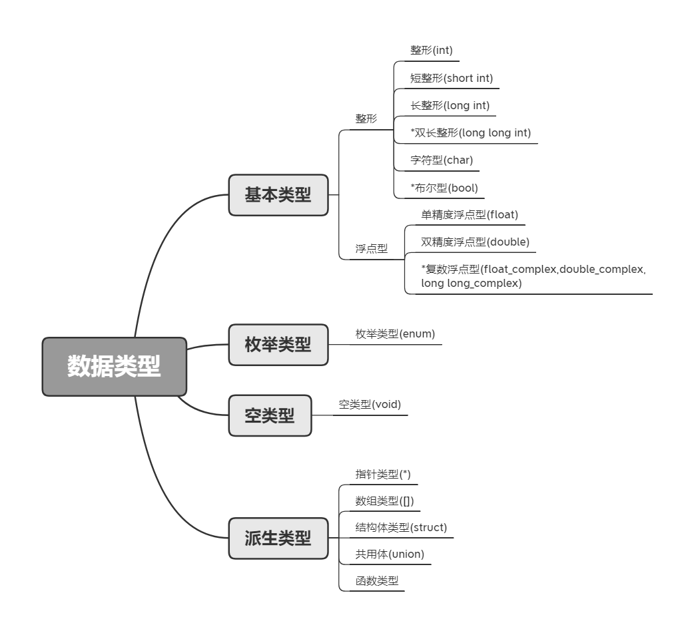

3.C语言基本概念
===========================

本章节将介绍C语言的基本概念,包括变量、数据类型、数据运算等,通过本章节将对C语言有个初步的了解,为后面学习打下基础。

3.1.变量概念
---------------------------

最初接触变量概念来自数学,例如笼子里有X只鸡,有Y只鸭,问一共有几只动物?这里面变量即为X、Y,X和Y就是对 ``未知`` 鸡和鸭的数量的别名。数学中我们习惯用英文字母来标识变量,我们就得到笼子中的动物总数为Z,则Z=X+Y。这样每次计算动物总数Z时,只要将X和Y替换为具体的鸡鸭的数量即可。在C语言中也是同样道理,可以通过定义变量int chicken;int douck;表示笼子中的鸡和鸭的个数。再定义一个变量表示动物数量int animal;则动物的数量即为animal = chicken + douck;

c语言中, :guilabel:`变量代表一个有名字的、具有特定属性的一个存储单元` 。它用来存放数据,也就是存放变量的值，在程序运行期间,变量的值是可以改变的。通过变量概念的定义可以知道, ``变量的本质是存储单元``,程序在编译的时候编译系统为每个变量分配一个内存地址,通过变量名的方式读取或者写入数据。学习变量需要从以下几点切入: ``变量名、变量值、变量的数据类型``。 

3.1.1.C语言标识符命名规则
~~~~~~~~~~~~~~~~~~~~~~~~~~

计算机高级语言中,将变量、符号常量名、函数、数组、类型等命名的有效字符统称为 ``标识符`` 。前面说过在数学中通常使用X、Y来表示变量,C语言中对变量的命名做了进一步的规范。起到 ``见名知意`` 的目的,方便理解程序。

.. note::

  - 标识符只能是由英文字母(A~Z,a~z)和数字(0~9)或者下划线(_)组成。
  - 只能以英文字母或者下划线开头,不能以数字开头。
  - 标识符是区分大小写。
  - 不能使用关键字命名。

通过上面标识符的命名规则可以知道，标识符中不能出现中文字符或者其他特殊字符，标识符不能以数字开头，如"1234hello"显然是不对的，"hello1234"或者"hello_1234"是正确的标识符，标识符也是区分大小写的，如"hello"和"Hello"是两个不同的标识符，也不能以C语言关键字来命名标识符，如"int"、"if"等C语言关键字也不能作为标识符。

上面说到"hello1234"这样的标识符，虽然满足标识符的命名规则，程序编译也不会报错，但是不满足 ``见名知意`` 的目的，程序应该是简洁的、易读的，程序首先是给人看的，其次才是给计算机执行的。由此产生很多标识符的命名法，下面一一介绍说:

.. note::

  - ``下划线命名法`` 例如people_number,current_time,就是使用下划线来分割两个或者两个以上单词。
  - ``驼峰命名法`` 例如serialNumber，第一个单词小写，后面单词首字母大写。

不建议使用a、b这类看不出含义的变量，同时也不建议使用汉语拼音代替单词，具体使用哪一种命名法则，需要根据已有程序使用的命名法则灵活使用，不用拘泥于一种命名法则。

3.1.2.C语言关键字
~~~~~~~~~~~~~~~~~~~~~~~~

C语言关键字是具有特定含义的字符,例如int关键字可以用来定义一个整型的变量,if关键字可以进行条件判断。这些关键字不能够用作标识符,关键字将会伴随着学习C语言的全部过程,关键字的含义和用法将在后续的学习中逐渐深入。

随着C语言的发展,C语言关键字的数量也在发生变化,一般使用ANSI C定义的32个关键字。常用的关键字也就这些,其他的关键字会在Linux源码中见到,看到再查就可以,只要掌握如下32个关键字已经够用。

.. csv-table:: C语言关键字
  :align: center
  :widths: 15,15,15,15,15,15,15,15

  auto,   break,  case,     char,   const,    continue, default,  do
  double, else,   enum,     extern, float,    for,      goto,     if
  int,    long,   register, return, short,    signed,   sizeof,   static
  struct, switch, typedef , union,  unsigned, void,     volatile, while

.. literalinclude:: ./../code/area_circle.c
   :caption: area_circle.c
   :language: c
   :linenos:
   :name: area_circle.c

3.2.常量概念
-------------------------------

常量是指值不变的量。

3.2.1.常量分类
~~~~~~~~~~~~~~~~~~~~~~~~~~~~~~

1. ``数值常量`` 顾名思义就是由数字构成的常量,如128、256、1000这种整数在C语言中叫做 ``整型常量``;如1.22、3.142等带有小数点的称为 ``实型常量也称为浮点数``,实数型常量又可以用两种形式表现,一种就是我们经常用的十进制小数形式,如123.456、23.56等,但是由于计算机的内存限制和计算规则以及工程科学中对于数值计算的要求,经常会用科学计数法来表示实数,另外一种就是指数形式,如12.34e3(代表12.34乘以10的3次方),在C语言中规定用e/E来代表以10为底的指数,在e的前面必须有数字,e的后面必须为整数。
2. ``字符常量`` 即为用字符构成的常量,也可由两种表现形式:一是 ``普通字符`` 如'a'、'Z'、'3'、'?'、'#'、' , '用 ``单引号''括起来``,事实上这些字符常量在计算机中是以ASCLL码表示的,如'a'在计算机中代表的就是97这个数值。二是 ``转义字符`` 这是C语言自己定义的字符,是一种控制字符,以字符\\开头,如经常使用的'\\r'表示回车,'\\n'表示换行。所谓转移字符就是将"\\"后的字符用为其他作用。
3. ``字符串常量`` 是字符常量的集合版本,将多个字符用 ``双引号""括起来``,就是字符串常量,如"hello"、"123"。
4. ``符号常量`` 通过定义,代表一个数值的符号就是符号常量,也被叫做 ``宏定义``。一般使用大写字母表示,如:#define PI 3.1415。PI就是符号常量，PI就代表3.1415，使用符号常量的优点,首先有 ``见名知意``,在程序规范中尽可能减少常数的使用,尽可能使用“见名知意”的变量名或者符号常量。还有 ``一改全改`` 的作用,例如修改圆周率的精度为3.141596,需要将所有用到圆周率的地方全部修改,而使用符号常量只需要一次修改即可。

.. csv-table:: 转义字符
  :align: center
  :header: 转义字符, 字符值, 输出结果
  :widths: 15, 15, 30

  \\a,              警告(alert),                 产生声音或视觉信号
  \\b,              退格(backspace),             将当前位置后退一个字符
  \\f,              换页(form feed),             将当前位置移到下一页的开头
  \\n,              换行,                        将当前位置移到下一行的开头
  \\r,              回车(carriage return),       将当前位置移到本行的开头
  \\t,              水平制表,                     将当前位置移到下一个tab位置 
  \\v,              垂直制表,                     将当前位置移到下一个垂直制表对齐点
  \'\',             单引号(''),                   具有此八进制的字符
  \"\",             双引号(""),                   输出此字符
  \?,               问号(?),                      输出此字符
  \\\,              反斜杠,                       输出此字符

3.2.2.常变量
~~~~~~~~~~~~~~~~~~~~~~~~~~~~~~
           
在C语言中有一种特殊的变量,就是常变量。常变量的使用为const int a = 3;与上面int chicken;类似只是在int前面加了const修饰,表明这个变量只能在定义的时候初始化为3,后面禁止修改。上面圆周率使用符号常量定义，也可以使用常变量定义为const float pi = 3.1416; ``常变量通过const这个关键字来赋予变量只读的属性``。

符号常量与常变量的区别？
符号常量发生在编译前,不会分配储存单元,#define是预编译指令,将所有使用的符号常量全部替换。而常变量是发生在编译后,分配储存单元的,只不过变量的值不能改变而已。

3.3.数据类型
------------------------------

数据类型即编译系统为变量分配的存储单元长度和变量值的存储结构。

``数据类型界定了变量的数据取值范围``,比如unsigned char people;定义了一个"unsigned char"类型的变量people,"unsigned char"的取值范围是0到255,如果people存放的是一所大学的学生人数,显然是不合理的,一般情况一所大学的学生人数是超过255人的。

``数据类型决定了变量的存储结构``,我们知道计算机中只能够存储二进制数据,如定义数据类型为整型int number;和浮点型float number;的变量存储方式是不同的。

3.3.1.数据类型分类
~~~~~~~~~~~~~~~~~~~~~~~~~~~~~

已经知道int chicken;由3部分组成。"int"是C语言关键字,表示chicken这个变量是整形,是对变量的数据类型的修饰。"chicken"即为变量,需要遵从C语言变量命名规则。";"分号表示一句话的结束,也就是C语言语句的结束标志。这就是C语言语法规则,按照这个规则就能定义一个变量。

   数据类型分类

3.3.2.基本数据类型取值范围
~~~~~~~~~~~~~~~~~~~~~~~~~~~~

.. csv-table:: 整形存储空间和取值范围
  :align: center
  :header: 类型(整形), 存储空间大小, 最小值, 最大值
  :widths: 30, 15, 30 ,30

  char(signed char),             1个字节,         -128,                 127
  unsigned char,                 1个字节,         0,                    255
  short,                         2个字节,         -32768,               32767
  unsigned short,                2个字节,         0,                    65535
  int,                           4个字节,         -2147483648,          2147483647
  unsigned int,                  4个字节,         0,                    4294967295
  long,                          4个字节,         -2147483648,          2147483647
  unsigned long,                 4个字节,         0,                    4294967295
  long long(C99),                8个字节,         -9223372036,          9223372036
  unsigned longlong (C99),       8个字节,         0,                    18446744073

.. csv-table:: 浮点型存储空间
  :align: center
  :header: 类型(浮点型), 存储空间大小, 取值范围
  :widths: 30, 15,30

  float,        4个字节,      0以及1.2*10^-38~3.4*10^38
  double,       8个字节,      0以及2.3*10^-308~1.7*10^308
  long,         8个字节,      0以及2.3*10^-308~1.7*10^308

3.3.3.整形变量的存储结构
~~~~~~~~~~~~~~~~~~~~~~~~~~~~~~

C语言中，整数有两种表现形式，例如数字2，可以直接写作2，也可以写作2l,在数字2后面加一个字母l或者L，强制表示这是一个整数。

在存储单元中,整数以补码的方式存放。正数的补码是其二进制形式。负数补码先将此数的绝对值写出二进制形式,然后对所有位置的二进制形式取反,最后再加一即为此负数的补码。

假设用4个字节长度存储单元存放整数,正数6的补码也就是其二进制形式表示为00000000 00000000 00000000 00000110。求负数6的补码过程为先求出-6的绝对值的二进制表示00000000 00000000 00000000 00000110,然后按位取反11111111 11111111 11111111 11111001,再加1即为-6的补码11111111 11111111 11111111 11111010。最左面第一位表示符号,为0则表示为正,如果为1则表示为负。

.. note::

   - 整数以其补码方式存放在存储单元。
   - 正整数的补码为其二进制形式。
   - 负整数的补码为其绝对值的二进制形式按位取反后的值在加1.
   - 整数补码中左边第一位表示符号,为0则表示为正,如果为1则表示为负。

int的取值范围(-2^31~2^31-1)如何得到？当左边第一位为0,其余为全部为1的时候,取得最大值2^31-1。当左边第一位为1,其余为全部为0的时候取得最大值-2^31。

3.4.字符型变量的存储结构
----------------------------

C语言中，字符可以通过单引号''来表示。如'a','A','1'等。

知道了整形是通过补码的方式存放在存储单元,那么字符是如何存放在存储单元的呢？大多数系统都是使用ASCII码表来存储字符,例如大写字母'A'在ASCLL码表中的十进制为65,即通过65的二进制表示01000001来表示'A'。在ASCII码中包含了33个控制字符(具有某些特殊功能但是无法显示的字符)和95个可显示字符;

.. figure:: ./../media/ASCLL.png
   :width: 80%
   :alt: ASCII码表
   :align: center

   ASCII码表

1. 通过ASCLL码表可以看出,大写字母'A'的ASCII码十进制为65,小写字母'a'的ASCII码十进制为97,可以用大小写字母切换。
2. 数字字符不等于数字，字符'1'的ASCII代码是十进制数49,数字1的ASCII码就是1。
3. 空格字符' '的ASCII代码是十进制数32,并不是没有ASCII码

3.5.浮点型变量的存储结构
----------------------------

浮点数也就是实数,例如12.34可以直接写作12.34或者12.34f,通过加字母f或者F强制表示这个是浮点型数据，也可以写作指数形式1.234e1(1.234乘以10的1次方),C语言中浮点数在以其指数方式表示时候。由于小数点可以向前或者向后移动,只要同时改变指数的值,就可以保证浮点数的值不变,因此被称为浮点数。

.. code-block:: c
   :caption: 定义一个浮点型变量
   :linenos:

   float pi = 3.14;                     //定义一个单精度浮点型变量pi
   float pencil_price = 1.5f;           //定义一个单精度浮点型变量pencil_price
   float student_number = 2.14e5;       //定义一个单精度浮点型变量student_number

前面说过数字按照其补码的二进制在存储单元存放，字符按照ASCII码的二进制形式存放在存储单元，C语言中浮点数以指数方式存放，具体是如何存放的呢？根据国际标准IEEE754,任意二进制浮点数的表示方式：

.. note::

  浮点数V表示为(-1)^S*M*2^E形式，(-1)^S表示符号位,当S=0时，V为正数；当S=1时，V为负数。M表示有效数字，且1<=M<2，2^E表示指数位

例如圆周率pi=3.14,写成二进制为11.1110，相当于1.1111*2^1，则有S=0，M=1.1111，E=1，-3.14可以表示为-1.1111*2^1，则有S=1，M=1.1111，E=1，存储单元中也就存放和S、M和E相关的值来表示浮点数。浮点数的存储结构相对复杂，不用花太多时间，后面在共用体时候将介绍如何巧用浮点数存储结构将浮点数转换为16进制，这在传输浮点数数据非常有意义。

3.6.运算符
-------------------------

定义变量的最终目的是计算,如下学习C语言的数据运算

3.6.1.算术运算符
~~~~~~~~~~~~~~~~~~~~~~~~~~~~

3.6.2.算术运算符优先级
~~~~~~~~~~~~~~~~~~~~~~~~~~
                      
双目运算符+和-具有相同的优先级,它们的优先级比运算符\*、/和%的优先级低,而运算符\*、/和％的优先级又比单目运算符+(正号)和-(负号)的优先级低。

.. list-table:: 算数运算符
    :widths: 15 10 30
    :header-rows: 1
    :align: center

    * - 运算符
      - 含义
      - 举例
    * - \+
      - 正号运算符
      - +a
    * - \-
      - 减号运算符
      - -a
    * - \*
      - 乘法运算符
      - a*b
    * - \/
      - 除法运算符
      - a/b
    * - \%
      - 求余运算符
      - a%b
    * - \+
      - 加法运算符
      - a+b
    * - \-
      - 减法运算符
      - a-b

3.6.3.自增、自减
~~~~~~~~~~~~~~~~~~~~~~~~~~~~~~~

自增、自减运算符
自增1运算符记为“++”,其功能是使变量的值自增1;自减1运算符记为“--”,其功能是使变量值自减1。

自增1,自减1运算符均为单目运算,都具有右结合性。可有以下几种形式:

.. note::

  - ++i:i自增1后再参与其它运算。
  - --i:i自减1后再参与其它运算。
  - i++:i参与运算后,i的值再自增1。
  - i--:i参与运算后,i的值再自减1。

.. code-block:: c
   :caption: Hello, world!程序
   :linenos:

   #include <stdio.h> //预处理命令 /*\* \* 程序执行的入口点。 \*/ 

   int i = 3;
   int j = 3;

   int main() 
   {
      printf("%d\r\n",i++);
      printf("%d\r\n",++i);
      printf("%d\r\n",j--);
      printf("%d\r\n",++j);
      return 0; 
   }

3.6.4.关系运算符
~~~~~~~~~~~~~~~~~~~~~~~~~~~

关系运算符都是双目运算符,其结合性均为左结合。关系运算符的优先级低于算术运算符,高于赋值运算符。在六个关系运算符中,<、<=、>、>=的优先级相同,高于==和!=,==和!=的优先级相同。

.. csv-table:: 关系运算符
  :align: center
  :header: 关系运算符, 含义, 数学中的表示
  :widths: 15, 30, 15
  
  <,            小于,         <
  <=,           小于或等于,   ≤
  >,            大于,         >
  >=,           大于或等于,   ≥
  ==,           等于,         =
  !=,           不等于,       ≠

3.6.5.逻辑运算符
~~~~~~~~~~~~~~~~~~~~~~~~~

.. csv-table:: 逻辑运算符
  :align: center
  :header: 运算符, 说明, 结合性, 举例
  :widths: 15, 40, 30,40

  &&,        与运算 双目 对应数学中的“且”,      左结合,     1&&0、(9>3)&&(b>a)
  ||,        或运算 双目 对应数学中的“或”,      左结合,     1||0、(9>3)||(b>a)
  !,         非运算 单目 对应数学中的“非”,      右结合,     !a、!(2<5)

3.7.强制类型转换
--------------------------

3.8.数据输入与输出
-------------------------

