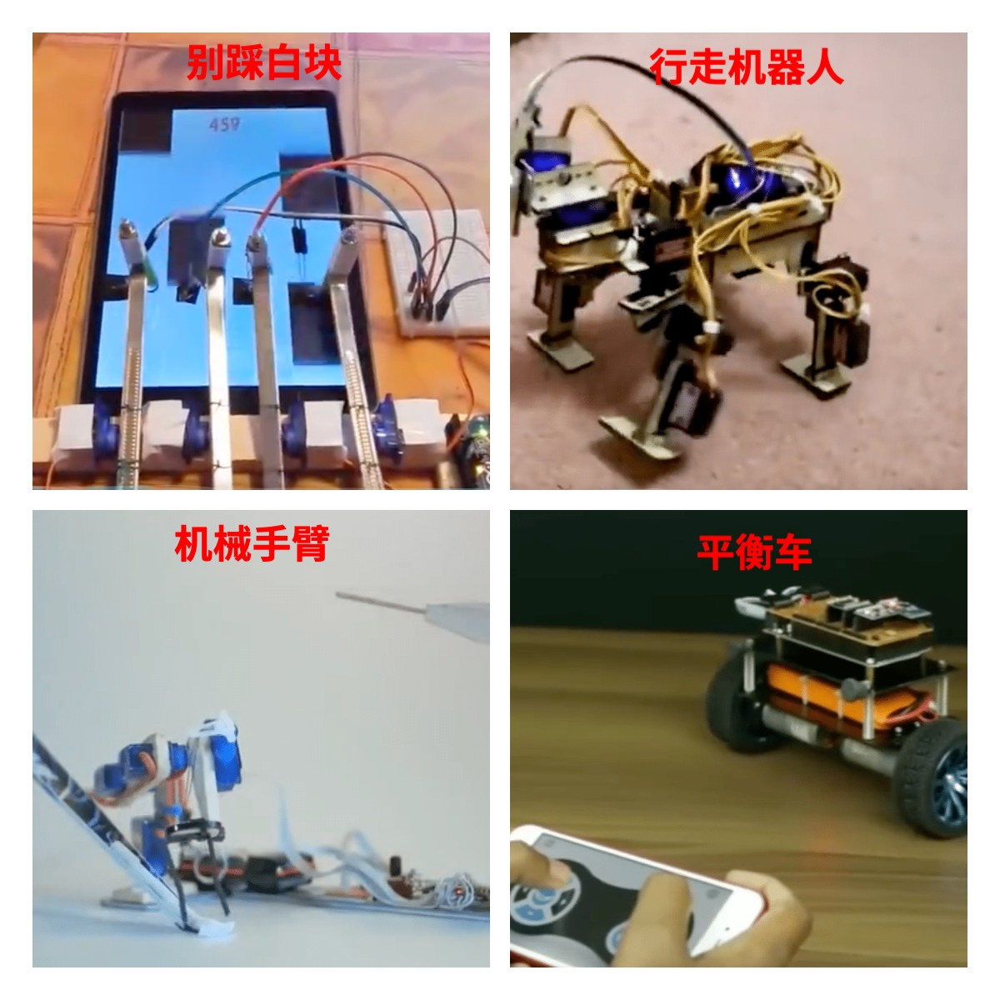
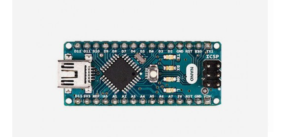
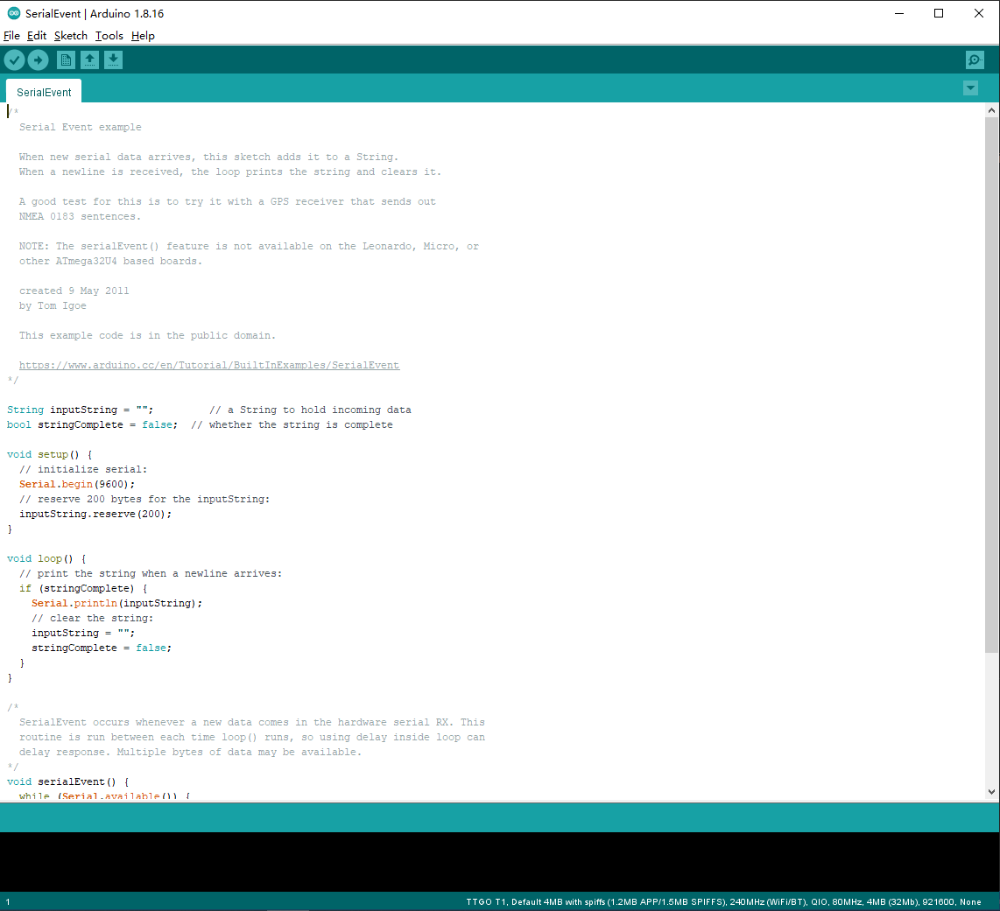

1.Arduino 教程介绍
===================================
我写的《Arduino从入门到放肆》系列教程在CSDN上获得大家好评,本系列教程旨在 ``帮助没有软硬件编程基础的人入门硬件编程`` 。这是《Arduino从入门到放肆》系列教程的第二版,相比于第一版有如下变化:

1. ``增加视频教程``
2. ``增加基本知识介绍``
3. ``增加更多小项目``

Arduino 教程介绍
-----------------------------------

说下自己学习硬件编程心路,就能明白我为什么做这个教程。大一的时候接触到编程,做的第一个作品是 ``心型灯`` ,使用51单片机的方案,其实就是自己焊接电路板,用现成的程序。后来寒假的时候自己想做一个 ``扫地机器人`` ,但是苦于C语言不熟练,51单片机编程复杂,中间走了很多弯路,一直被搁置。大二在学校参加电子设计比赛接触到STM32单片机,STM32单片机使用库函数编程相比于51单片机操作寄存器更加友好。大三学习单片机课, ``降维打击`` 再学习51单片机,才把51单片机学习熟练。

后来我想如果我能早点接触到Arduino,借助Arduino丰富的开源库,把精力放在好的创意上,而不是复杂的编程上,是不是能做出很多 ``有趣`` 的作品？通过有趣的作品获取信心然后再学习复杂的硬件编程,是不是能学的更加 ``高效`` 呢？

我想通过这个教程在 :guilabel:`没有任何软件以及硬件编程基础的前提` ,使用Arduino花费 ``极低的代价`` 学习软硬件编程基础知识,实现自己的创意。并将学到的知识用到学习和工作中。

Arduino 能做什么
-----------------------------------

---------------------------------------

Arduino 编程入门的核心
~~~~~~~~~~~~~~~~~~~~~~~~~~~~~~~~~~~

Ardunio学习的核心是 ``教程、练习、项目`` ,Arduino的学习是掌握一门技能,而不是学术研究。将学到的用于实践,在实践中遇到问题再继续学习, ``学和用两者相辅相成``。

- 教程可以是视频、纸质书、电子文档等任何你喜欢的方式都可以,开始的时候看视频便于理解,后续直接看文档资料才是效率最高。
- 实践按照教程实际动手编写教程中的代码、做教程中的小实验。遇到不理解先照做再理解。
- 发挥自己的想象力做一个实际的小小项目。例如智能垃圾桶、感应路灯等,按照自己的想法做出来。

Arduino 学习必备的基础条件
~~~~~~~~~~~~~~~~~~~~~~~~~~~~~~~~~~~

- 电脑:在电脑上编程,并将编写好的程序下载到Arduino开发板上。

- Arduino开发板: 教程以 ``arduino nano`` 开发板为例,价格便宜。

- 其他:面包板、外设、传感器、杜邦线、USB数据线等。

Arduino 介绍
-----------------------------------

一直在说Arduino,Arduino到底是什么? Arduino是一个开源 ``硬件和软件开发平台`` 。包含可编程硬件(各种arduino开发板)和arduino IDE(集成开发环境)组成。 ``Arduino也是一种低代码硬件编程方式`` 。

Arduino 硬件简述
~~~~~~~~~~~~~~~~~~~~~~~~~~~~~~~~~~

Arduino 有很多开发板,我们教程就是以下面最基础的 ``Arduino nano`` 开发板为例,Arduino开发板一般分为两类:

- 官方板:Arduino官方板是Arduino官方推出的开发板,兼容性好,质量好,价格相对较高。

- 非官方板:由于Aruino的硬件是开源的,因此被做出很多其他版本,被称为非官方板,非官方板相比于官方板兼容性较差,需要手动安装驱动软件,质量相对较差,当然价格也相对较低。

---------------------------------------
.. note::
   如果有条件且乐于为 ``开源做贡献``,就购买官方板。也可以在淘宝购买10元包邮的非官方板,但是基本功能都是一样的,拿来使用是完全没有问题的。

Arduino 软件简述
~~~~~~~~~~~~~~~~~~~~~~~~~~~~~~~~~~~

Arduino IDE是Arduino硬件开发环境,使用者可以在Arduino IDE软件中编写程序,并可以将代码烧录到Arduino硬件上运行。

--------------------------------------

Arduino 开发方式
~~~~~~~~~~~~~~~~~~~~~~~~~~~~~~~~~~~

很多人选择Arduino用来学习或者使用的主要原因就是Arduino开发简单且高效,Arduino为使用者集成了很多api,这些丰富的api可以让使用者屏蔽实现细节,专注于功能实现。例如ESP32、NRF52840等芯片目前也适配了Arduino IDE,适配后的硬件可以继承Arduino丰富的第三放软件库。原本需要耗费大量时间集成软件,现在只需要简单的调用即可。

