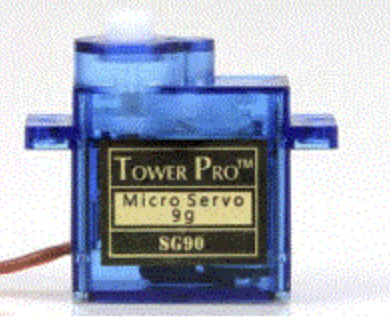
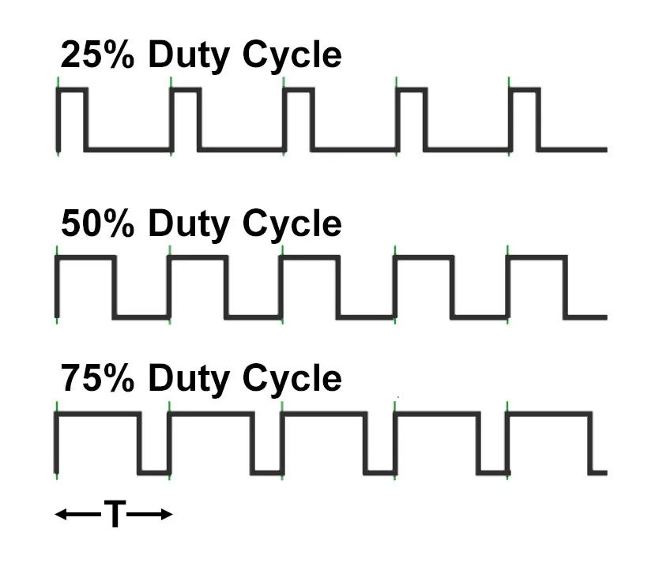

🌟10.Arduino 舵机控制🌟
===================================
<<<<<<< HEAD

🎯 SG90舵机介绍
~~~~~~~~~~~~~~~~~~~~~~~~~~~~~~~~~~~

``舵机是一种常用的伺服电机``，可以按照需要旋转不同角度。常见的有0-90度、0-180度、0-360度不等旋转角度。

----------------------------------

PWM舵机是通过可变的脉冲来控制的，控制线接到PWM管脚， ``舵机的PWM信号周期是20ms，占空比范围是0.5-2.5ms,1.5ms即为中位信号`` 。

180度舵机：1.5ms就是旋转到90度位置，2.5ms旋转到180度位置，0.5ms旋转到0度位置。

360度舵机：1.5ms速度为0，2.5ms是正转速度最大，0.5ms是反转速度最大。即 ``360舵机PWM进行速度控制，低于360度舵机PWM是角度控制`` 。

.. note::
   舵机是精密的产品，请勿大力扭动舵机旋转摆臂。大力扭动舵机旋转摆臂可能会对舵机产生不可逆的损坏。同时也不要在舵机上电或工作状态下拆装舵机。

🎯 PWM脉冲
~~~~~~~~~~~~~~~~~~~~~~~~~~~~~~~~~~~

​ 脉冲宽度调制(PWM)，是英文“Pulse Width Modulation”的缩写，简称脉宽调制，是一种广泛使用的控制信号。

``PWM 频率：`` 是指1秒钟内信号从高电平到低电平再回到高电平(1个周期T)的次数，例如1秒钟5次这样的周期，则频率为5Hz。

``PWM 周期：`` 周期T是频率f的倒数，例如1秒钟5Hz，则周期为200ms。

``PWM 占空比：`` 一个脉冲周期内，高电平的时间与整个周期时间的比例。

SG90 180度舵机的参数也可被描述为：舵机的工作频率为50HZ（周期20ms）,工作占空比范围是2.5%-12.5%,当占空比为7.5%时旋转到90度位置，当占空比为12.5%时旋转到180度位置，当占空比为2.5%时旋转到0度位置。

----------------------------------

🎯 Arduino PWM
~~~~~~~~~~~~~~~~~~~~~~~~~~~~~~~~~~~

Arduino Nano开发板D3、D5、D6、D9、D10、D11均可输出PWM信号。本例使用Arduino提供的舵机控制库来实现舵机控制。

.. figure:: ../media/Arduino外设资源.png
   :alt: Arduino外设资源
   :align: center

----------------------------------

.. literalinclude:: ./../code/10.servo/10.servo.ino
   :caption: 10.servo.ino
   :language: c++
   :linenos:
   :name: 10.servo.ino
=======
 
舵机是一种常用的伺服电机,可以按照需要旋转不同角度。Arduino库已经为我们简化了舵机的使用,只需要根据需要设定不同的旋转角度值即可

🚀准备知识

使用的SG90舵机工作电压是4.8V,接到5V也是没有问题的,图中的黄色实际接近橙色连接信号脚D9

#### 📝编写代码

🔸attach()

🔸write()

🔸map()

attach()指定信号线接在Arduino那个引脚

write()写入舵机旋转角度的度数,0-180°

map()数值映射函数,例如用analogRead()读取的数值范围为0-1023,而write()输入范围为0-180,因此可以使用

.. code-block:: c
   :caption: 定义一个浮点型变量
   :linenos:

    int val = analogRead(PIN);         //PIN为电压输入引脚定义,analogRead()读取数值
    val = map(val, 0, 1023, 0, 180);   //将0-1023换算到0-180
    myservo.write(val);                //写入角度值

.. code-block:: c
   :caption: 定义一个浮点型变量
   :linenos:

    #include <Servo.h>                         //引用头文件

    Servo myservo;                             // 定义Servo对象
    int pos = 0;                               // 角度变量

    void setup() {
      myservo.attach(9);                       // 控制线连接数字D9
    }
    
    void loop() {
      for (pos = 0; pos <= 180; pos ++) {     // 0°到180°
        myservo.write(pos);                   // 舵机角度写入
        delay(100);                           // 等待舵机机械响应时间,同样也可以控制旋转1°的快慢
      }
      
      for (pos = 180; pos >= 0; pos --) {     // 从180°到0°
        myservo.write(pos);                   // 舵机角度写入
        delay(10);                            // 10ms延时,旋转1°速度大于100ms
      }
    }

#### 👍上传代码

上传代码,舵机在0-180°缓慢旋转,180-0°快速旋转

>>>>>>> 631d27d4cacb4045b66bf03896d2ce6df1a79a80
