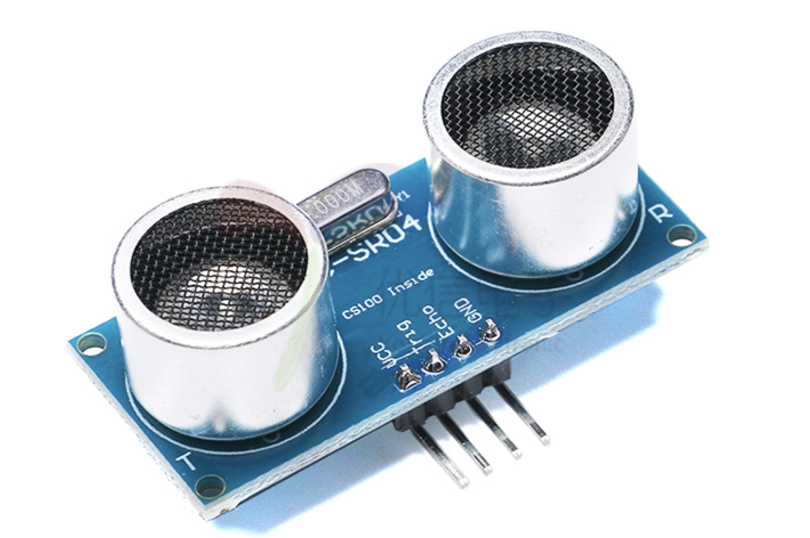
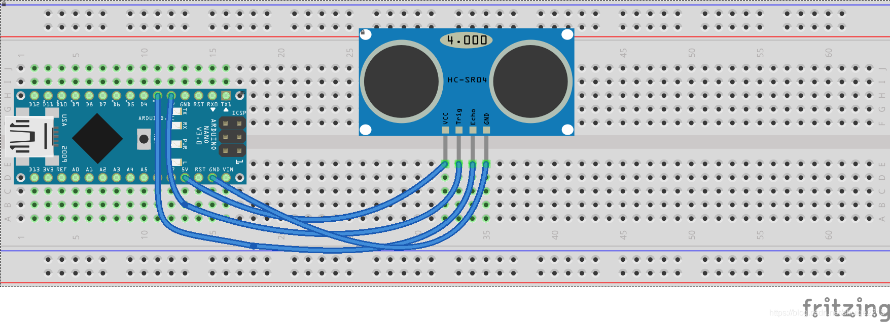

11.Arduino 超声波测距
===================================

HC-SD04超声波🎯 
----------------------------------

超声波模块利用 ``声波的反射原理`` ,模块TRIG管脚持续10us低电平,触发发射器发射8个40KHZ的超声波脉冲,同时ECHO管脚输出高电平。声波被被测物体反射到超声波接收器,当接收器接收到超声波信号时ECHO管脚变为低电平,此时高电平持续时间就是声波往返时间,根据声音的速度以及发射到反射回来的时间差,可以计算模块到被测物体的距离。

HC-SD04超声波 ``最大可测量6m`` 的距离, ``最短可以测量2cm`` 的距离。

-----------------------------------

🎯 测量程序
-----------------------------------

程序中使用 :guilabel:`pulseIn()` 函数来获取高电平持续时间。 默认ECHO低电平,发射脉冲时开始输出高电平直到接收到脉冲信号输出低电平。这个高电平持续时间通过pulseIn()函数读取。pulseIn()函数第一个参数时使用哪个管脚来接收电平信号,第二个参数是记录高电平时间还是低电平时间,单位是ms。

-----------------------------------

.. literalinclude:: ./../code/11.ultrasound/11.ultrasound.ino
   :caption: 11.ultrasound.ino
   :language: c++
   :linenos:
   :name: 10.servo.ino

超声波传感器利用中学物理知识，声波在空气中传播速度大约340m/s，因此计算发射到接收在空中飞行时间，将飞行时间的一半乘以声波速度，就可以得到超声波传感器到障碍物的位置
