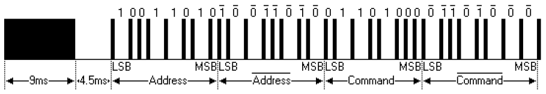
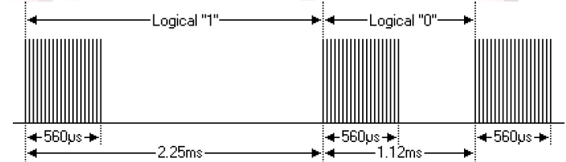
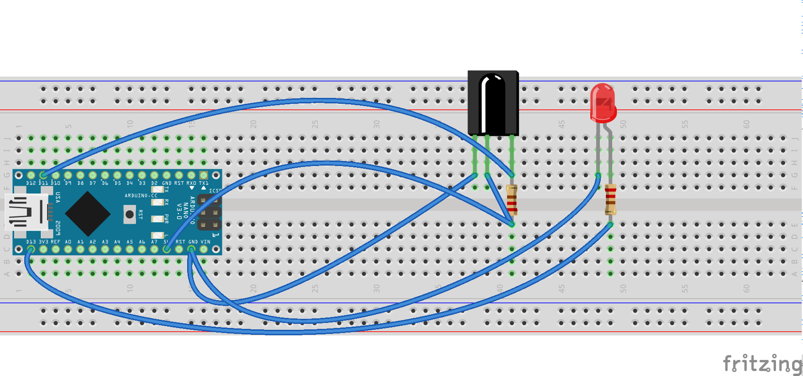

13.Arduino 红外控制LED灯
===================================

红外
-----------------------------------

红外遥控由发射部分和接收部分两部分组成，发射部分通过控制控制红外发光管发射出经过调制好的红外线来传递需要发送的信息，接收部分电路由红外接收管等其他红外接收器件接收发射管发射的红外光传递信号给放大器以及其他解码设备来还原红外发射的信息！

.. figure:: ../media/红外接收发送.png
   :alt: 红外接收发送
   :align: center

-------------------------------------

NEC红外遥控协议
----------------------------------

我们这里的NEC编码就是红外的一种调制方式，对发射的红外进行特定的编码来发送我们需要发送的信息，接收端针对发射端的编码进行解码从而达到还原信息，我们今天采用的编码方式为 NEC编码，另外还有其他的RC5,RC6很多种编码方式

-------------------------------------

-------------------------------------

程序源码
----------------------------------

.. literalinclude:: ./../code/13.ir_remote/13.ir_remote.ino
   :caption: 13.ir_remote.ino
   :language: c++
   :linenos:
   :name: 13.ir_remote.ino

实物连接
----------------------------------

