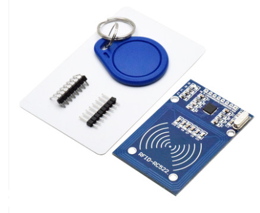

22.Arduino 智能门禁
===================================

设计要求
----------------------------------
使用Arduino Nano开发板设计一套实现具有可刷卡的门禁的装置,使用舵机模拟开门或者道闸动作,使用RFID读写卡实现刷卡功能。

使用材料
------------------------------------

- Arduino Nano开发板
- SG90 舵机
- RFID读写卡模块
- 杜邦线若干
- 其他

模块介绍
------------------------------------

RFID读写卡
~~~~~~~~~~~~~~~~~~~~~~~~~~~~~~~~~~~

RC522是一款工作在13.56Mhz的非接触式读写芯片,兼容14443A兼容应答信号,与主机 ``通过SPI进行通信`` ,工作电压是3.3V。

-------------------------------------

SPI总线
~~~~~~~~~~~~~~~~~~~~~~~~~~~~~~~~~~~~~

SPI(Serial Peripheral interface),串行外围设备接口。一种高速的,全双工,同步的通信总线。SPl采用主从方式工作,一般有一个主设备和一个或多个从设备;SPI需要至少4根线,分别是MISO(主设备输入从设备输出)、MOSI(主设备输出从设备输入)、SCLK(时钟)、CS(片选)SPl使用引脚较少且布线方便,所以越来越多的芯片集成了这种通信协议；

实物连接
-----------------------------------

设计分析
-------------------------------------

程序源码
------------------------------------

