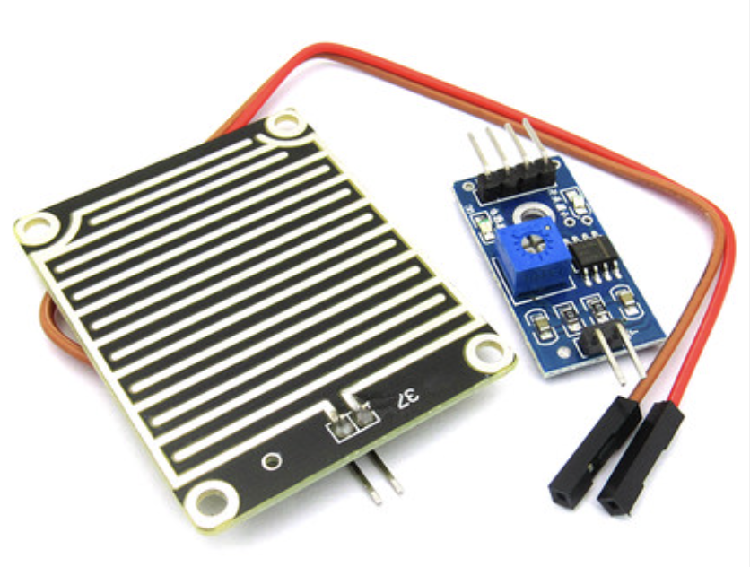

23.Arduino 下雨关窗
===================================

设计要求
----------------------------------

使用Arduino Nano开发板设计一套实现具有下雨自动关闭窗户的功能的装置,使用舵机模拟关窗动作,使用雨滴传感器检测雨滴

使用材料
------------------------------------

- Arduino Nano开发板
- SG90 舵机
- 雨滴传感器
- 杜邦线若干
- 其他

模块介绍
------------------------------------

雨滴传感器
~~~~~~~~~~~~~~~~~~~~~~~~~~~~~~~~~~~~

雨滴传感器可以检测下雨雨滴,如下图接触面的电极交叉排布,当雨滴落在两个交叉电极之间时就会形成 ``电阻``,雨滴越多电阻越小。 ``雨滴传感器可以检测是否下雨以及雨量大小`` 。雨滴接触面板的两个电极端接到 ``电压比较器`` 的输入端，通过调节电阻可以配置触发是否检测到雨滴的阈值,信号的输出也有两种方式。

- 模拟信号:雨量以模拟量(AO)电压的形式输出，处理器根据电压大小判断是否有雨滴以及雨量大小。
- 数字信号:只能输出是否有雨开关量(DO),不能判断雨量大小,当然通过调节电阻可以调节是否有雨阈值。

当接上3.3V到5V电源,电源指示灯亮,感应板上没有水滴时,DO输出为高电平,开关指示灯灭, ``滴上一滴水,DO输出为低电平,开关指示灯亮,刷掉上面的水滴,又恢复到DO输出高电平状态`` ,阈值可调节。AO模拟输出,可以连接单片机的AD口检测是否有雨滴以及滴在上面的雨量大小。

-------------------------------------

SG90舵机
~~~~~~~~~~~~~~~~~~~~~~~~~~~~~~~~~~~

实物连接
-----------------------------------

程序源码
------------------------------------

