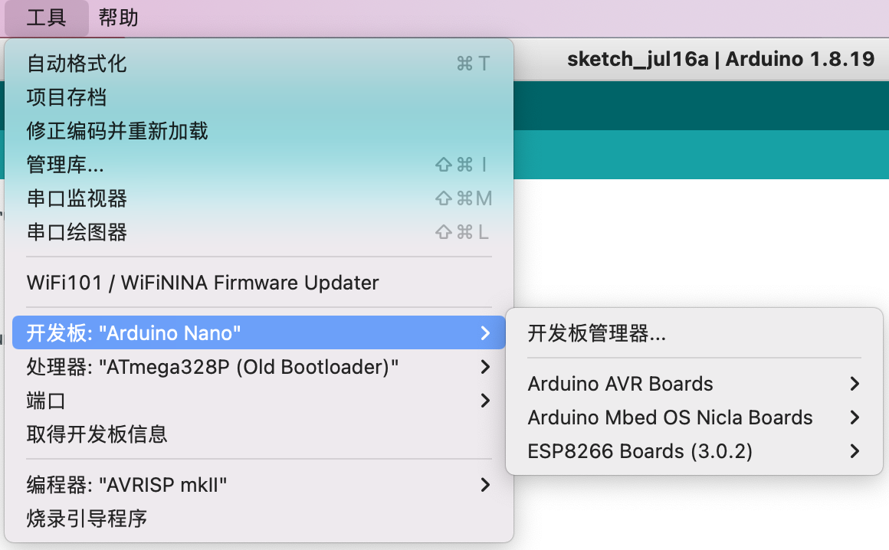

3.Arduino 程序结构
===================================

Arduino示例程序🎯
---------------------------------

当我们打开Arduino软件时候,会为我们新建一个模版程序

.. code-block:: c
   :caption: Arduino示例程序
   :linenos:

    void setup() {
    // put your setup code here, to run once:

    }

    void loop() {
    // put your main code here, to run repeatedly:

    }

Arduino程序结构🎯
---------------------------------

``setup()函数`` 或者称为setup()方法,只在上电或复位运行一次。主要处理在初始只执行一次的事件,例如需要控制LED闪烁,需要在setup()函数编写LED外设初始化程序,外设必须先初始化在使用。

``loop()函数`` 用来处理需要一直做的事情,直到程序结束。与一般编写的C语言程序有些区别,在C语言程序中有main()函数,在main()函数内的开头编写初始化程序,然后进入while(1)循环。

Arduino开发板选择🎯
---------------------------------

在Arduino IDE 菜单栏中找到工具-开发板,选择所使用的开发板。

----------------------------------

Arduino程序编译🎯
---------------------------------

编写好的程序首先需要编译,在Arduino IDE中也叫验证,如果编译报错需要继续修改代码,直到能够编译通过。

Arduino程序下载🎯
---------------------------------

在Arduino IDE 菜单栏中找到工具-端口选项,选择开发板对于的端口好。然后下载程序到开发板。

