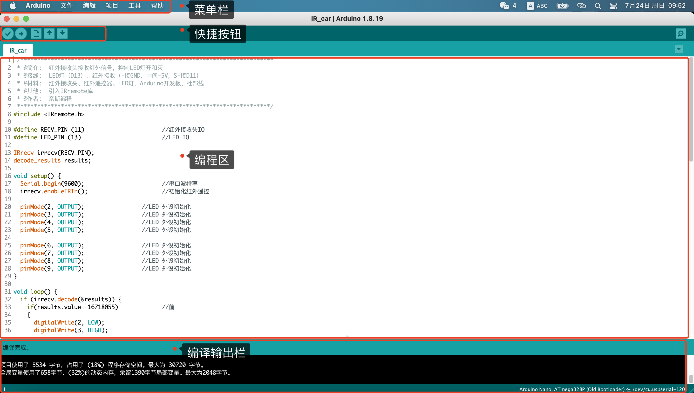
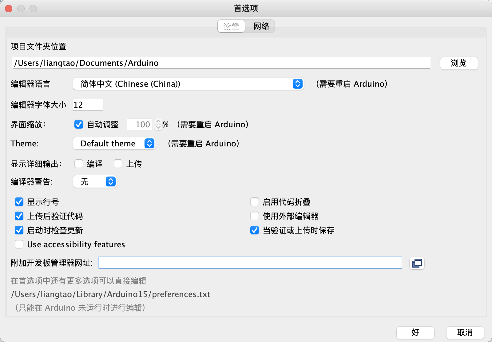
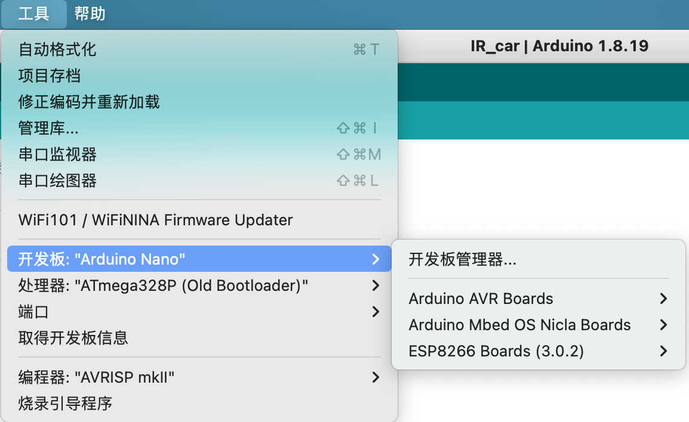
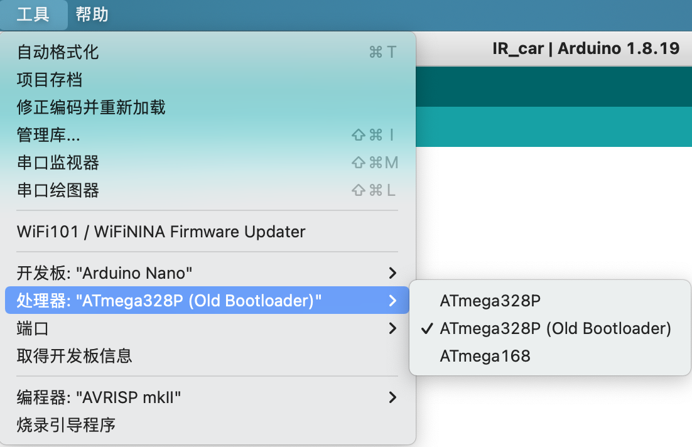
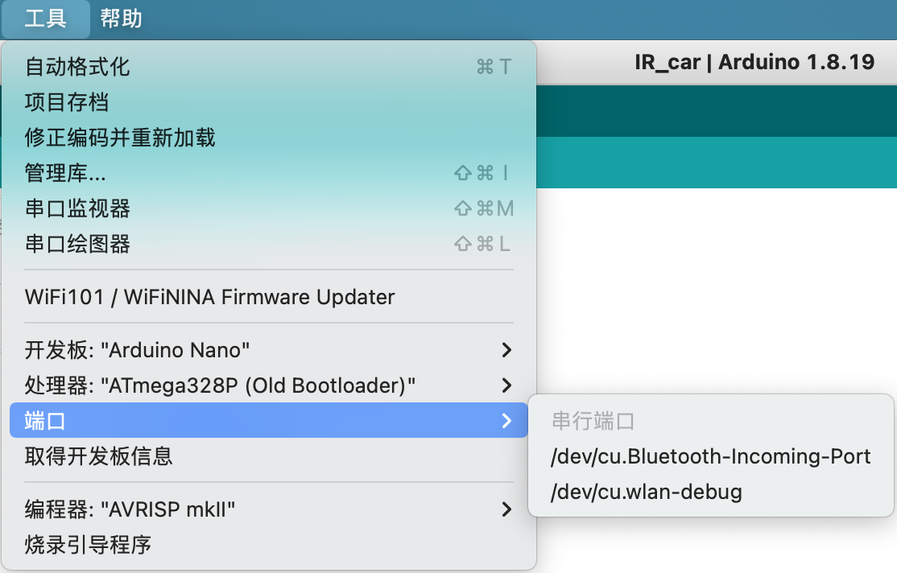
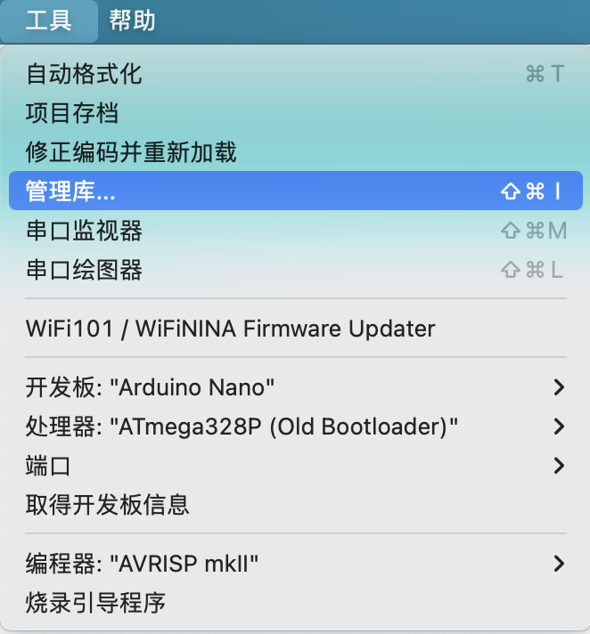

3.Arduino 软件使用技巧
================================

思考Arduino 开发的流程是怎样的？

1. 打开Arduino IDE软件,对软件进行初始设置。
   
2. 告诉Arduino IDE使用的开发板和处理器型号。
   
3. 导入使用的库文件,编译编写的程序并排除错误及警告
   
4. 选择固件烧录使用的端口,烧录固件到开发板

主界面
--------------------------------

Arduino IDE主要包含四个区域:

- 菜单栏:包含软件的全部的全部设置

- 快捷按键:编程常用的快捷键

- 编程区:编写程序的地方

- 编译输出区:编译程序,输出编译结果

---------------------------------------

首选项界面
--------------------------------

首选项界面可以配置Arduino IDE的语言,可以修改为 ``简体中文`` 也可以为英文,根据直接习惯修改，可以勾选 ``"显示行号"``

---------------------------------------

开发板选择界面
--------------------------------

---------------------------------------

处理器选择界面
--------------------------------

---------------------------------------

烧录和调试端口
--------------------------------

---------------------------------------

软件库管理界面
--------------------------------

---------------------------------------

快捷按键界面
--------------------------------

