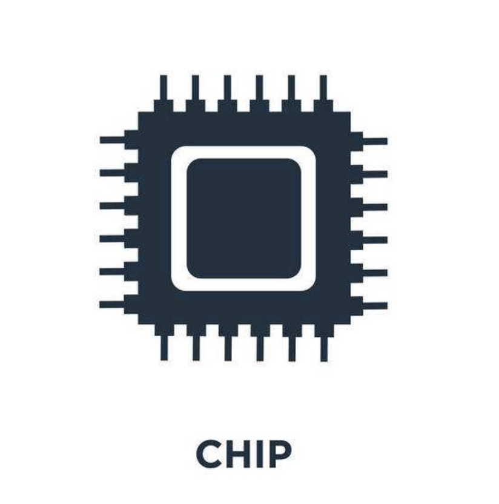
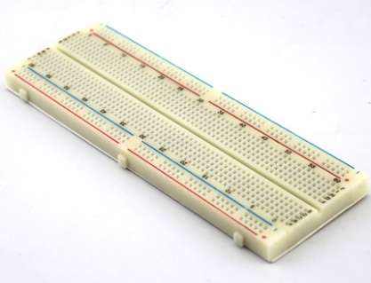
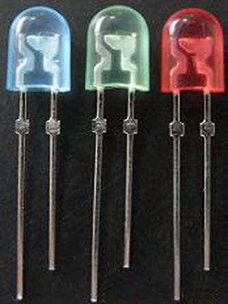
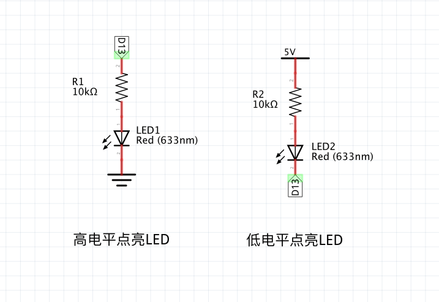
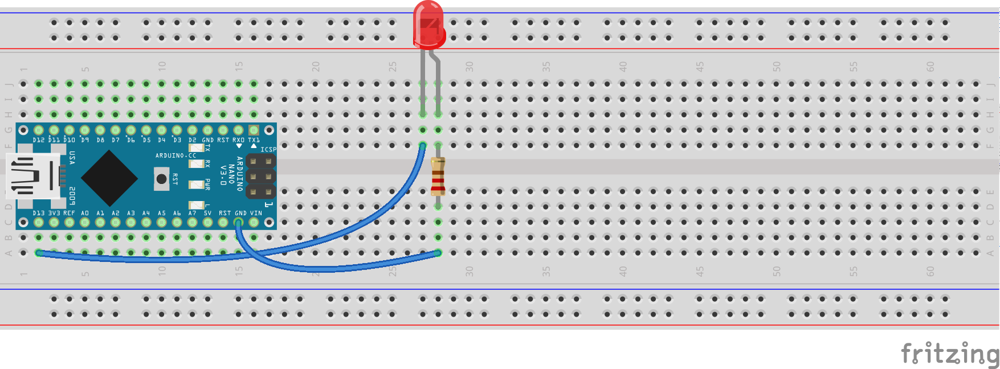

4.Arduino 点亮LED
===================================

在刚开始学习C语言时编写的第一行代码是 :guilabel:`printf("hello world");`。那么编写Arduino第一行代码是什么呢?Arduino编程一定是点亮一盏LED灯。今天我们一起做一位 ``点灯大师`` 吧！

GPIO的概念
----------------------------------
GPIO(General purpose input/output)通用输入输出的简称,站在软件的角度GPIO是可编程的引脚,电源的VCC和GND可以称为引脚,但是不能称为GPIO,因为其不能通过编程控制。站在硬件角度GPIO就是一个焊盘,连接到芯片内部,硬件中 ``焊盘、PIN、引脚`` 都是同义。

----------------------------------

Arduino硬件资源
----------------------------------

Arduino Nano 的 ``脚位图``,一般芯片会对IO进行分组,如A组包含A0到A15共计16个引脚,随着GPIO数量的增多ABC...依次编排下去。而Arduino使用另外一种编码方式,Arduino中将GPIO按照功能分为 ``数字引脚(Digital Pin)`` 和 ``模拟引脚(Analog Pin)`` 。数字引脚从D0开始编码,模拟引脚从A0开始编码。部分GPIO即可做模拟引脚也可做数字引脚,使用不同的功能也使用相应的名称即可。

.. figure:: ../media/Arduino外设资源.png
   :alt: Arduino外设资源
   :align: center

----------------------------------

面包板使用
----------------------------------

面包板是用来连接各个模块的电路板,具有以下特性:

- 蓝线负极孔沿着蓝线全部连接,红线正极孔沿着红线全部连接
- a1、b1...e1连接,f1、g1...j1连接,两部分互不相连,其他类似
- a1、a2...a63互不相连,f1、f2...f63互不相连,其他类似

----------------------------------

LED发光二极管
-----------------------------------

LED即发光二极管,引脚长为正极,短为负极或者内部晶体大为负极,小为正极

----------------------------------

逻辑电平
-----------------------------------

``高电平`` :高电平就是数字逻辑1,Arduino Nano 是5V供电,因此逻辑高电平就是5V。

``低电平`` :低电平就是数字逻辑0,低电平一般指0v电压。

----------------------------------

程序源码
----------------------------------

.. code-block:: c
   :caption: LED闪烁
   :linenos:

    void setup() {
      //如之前所说,注释是可以删除的,只是起到提示的作用
      //这里使用的13号引脚也就是脚位图上面的PB5,对应一个LED
      //pinMode(13, OUTPUT);的含义是我们使用13这个引脚,同时将它设置为OUTPUT输出模式,来驱动LED灯珠
      pinMode(13, OUTPUT);
    }

    void loop() {
      //digitalWrite(13, HIGH);含义是让13号引脚输出一个高电平,由于LED灯的负极恒接在低电平,
      //因此只要给正极一个高电平就能点亮LED
      digitalWrite(13, HIGH);         
      //保持1000毫秒,也就是保持亮1秒钟
      delay(1000);                    
      //在13号引脚上接入低电平LED就不能被点亮,熄灭
      digitalWrite(13, LOW);          
      //保持1000毫秒,也就是保持熄灭1秒钟
      delay(1000);   
      //loop()函数的含义就是不停的循环,亮灭亮灭...永无停歇                  
    }

实物连接
----------------------------------

