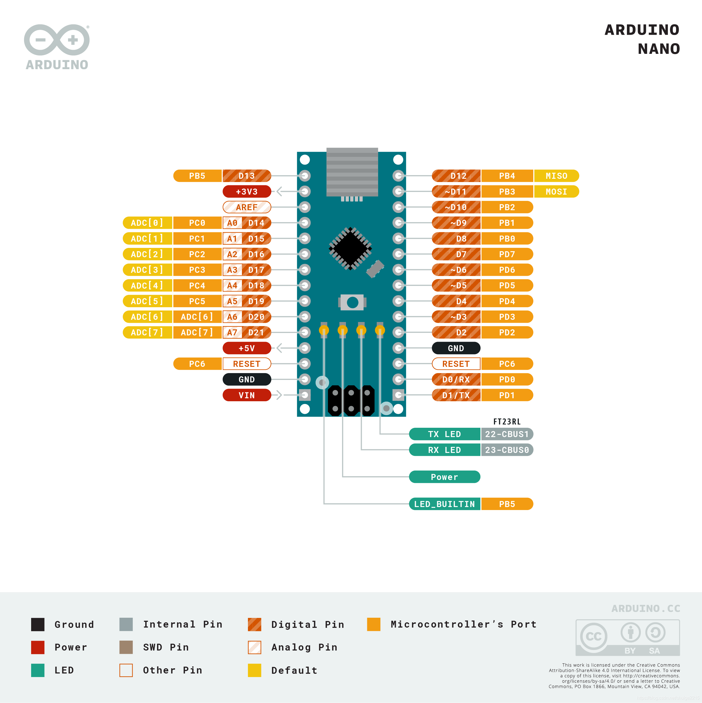

4.Arduino 点亮LED
===================================

在学习C语言的时候我们编写的第一行代码是 ``printf("hello world");`` 即通过控制台输出一段字符。那么编写Arduino第一行代码是什么呢?Arduino编程从点亮一盏LED灯开!今天我们一起做一位 ``点灯大师吧！`` 

Arduino资源介绍🎯
----------------------------------

首先我们先了解下Arduino Nano 的 ``脚位图``,由下图可以看出LED_BUILTIN这个LED是接在D13,我们在编写代码时候使用13或者LED_BUILTIN都可以。使用板上的LED也可以,我们外接一个LED灯。

----------------------------------

面包板🎯
----------------------------------
面包板是用来连接各个模块的电路板,具有一下特性:

- 蓝线部分沿着蓝线的 ``行孔连接`` ,划红线部分沿着红线的 ``行孔连接``
- 在 ``同一列孔‘A’B‘C’D‘E’连接``, ``列孔'F'G'H'I'J'连接``。 ``‘A’B‘C’D‘E’和'F'G'H'I'J'不连接``
-  ``'A'B'C'D'E'F'G'H'I'J'所在**行孔**相互均不连接``

LED发光二极管🎯
-----------------------------------

LED即发光二极管,引脚长为正极,短为负极或者内部晶体大为负极,小为正极

.. figure:: ../media/LED发光二极管.jpeg
   :alt: Arduino外设资源
   :align: center

----------------------------------

逻辑电平🎯
-----------------------------------

高电平:高电平就是数字逻辑1,Arduino Nano 是5V供电,因此逻辑高电平就是5V。
低电平:低电平就是数字逻辑0,低电平一般指0v电压。

.. code-block:: c
   :caption: LED闪烁
   :linenos:

    void setup() {
      //如之前所说,注释是可以删除的,只是起到提示的作用
      //这里使用的13号引脚也就是脚位图上面的PB5,对应一个LED
      //pinMode(13, OUTPUT);的含义是我们使用13这个引脚,同时将它设置为OUTPUT输出模式,来驱动LED灯珠
      pinMode(13, OUTPUT);
    }

    void loop() {
      //digitalWrite(13, HIGH);含义是让13号引脚输出一个高电平,由于LED灯的负极恒接在低电平,
      //因此只要给正极一个高电平就能点亮LED
      digitalWrite(13, HIGH);         
      //保持1000毫秒,也就是保持亮1秒钟
      delay(1000);                    
      //在13号引脚上接入低电平LED就不能被点亮,熄灭
      digitalWrite(13, LOW);          
      //保持1000毫秒,也就是保持熄灭1秒钟
      delay(1000);   
      //loop()函数的含义就是不停的循环,亮灭亮灭...永无停歇                  
    }
