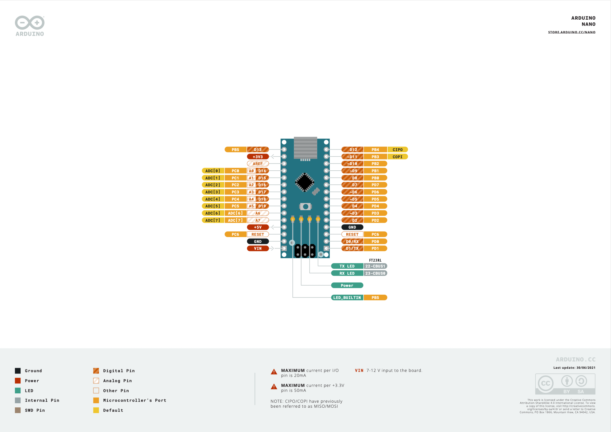
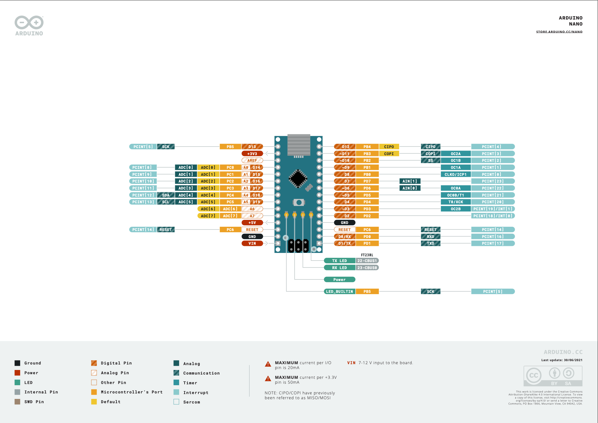
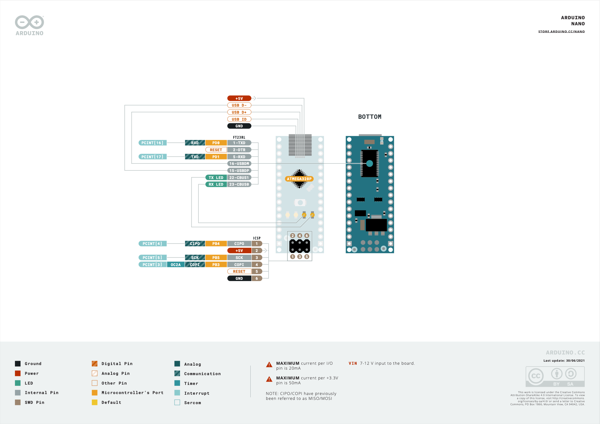

4.Arduino 硬件资源介绍
================================

Arduino Nano开发板
--------------------------------

atmega328 IO
~~~~~~~~~~~~~~~~~~~~~~~~~~~~~~~~

该板的核心是时钟频率为16MHz的 ``ATmega328`` 8位微控制器。提供20个数字输入/输出引脚,其中6可以复用为模拟引脚加上另外2个只能作为模拟引脚合计8个模拟引脚。

---------------------------------------

atmega328 硬件资源
~~~~~~~~~~~~~~~~~~~~~~~~~~~~~~~~~~~~~~

Arduino Nano拥有一组 ``串口(RX-D0,TX-D1)`` 用于串口烧录固件,也可以用于串口通讯。一组 ``SPI接口(COPI-D11,CIPO-D12,SCK-D13)`` 可以连接SPI外设,也可以进行SPI固件烧录。一组 ``I2C接口(SDA-D18,SCL-D19)`` 可以连接I2C外设。6组 ``PWM输出引脚(D3、D5、D6、D9、D10、D11)`` 用于电机等的控制,8组 ``模拟引脚(A0、A1、A2、A3、A4、A5、A7、A8)`` 可以接光敏电阻等。

---------------------------------------

Arduino Nano 烧录接口
--------------------------------

Arduino Nano可以通过两种方式烧录固件,一种是串口烧录,另外一种是SPI烧录。Arduino Nano开发板集成一颗串口转USB芯片,将电脑的USB协议转为atmega328支持的串口协议,通过mini-usb接口连接到电脑。下面的6针排针是用于SPI烧录的接口,一般适用于软件调试完成后工厂大批量烧录,开发以及调试使用串口下载更加方便。

