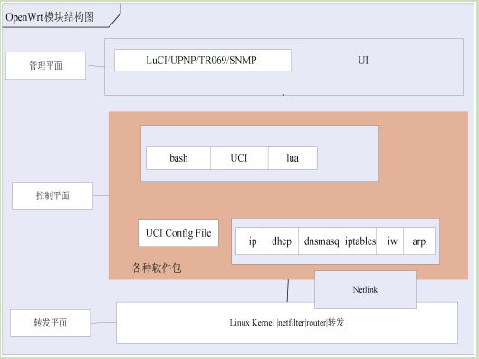
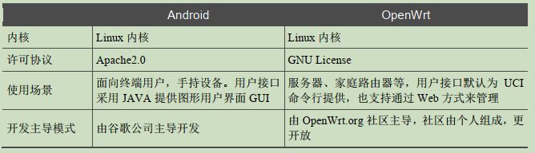
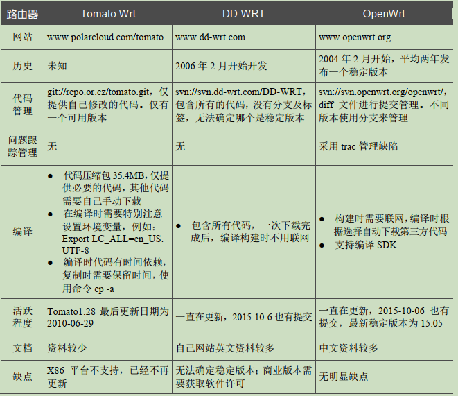

1.OpenWRT系统简介
=========================

由于工作需要接触到OpenWRT系统,发现目前这方面的资料不是很完善，要么是单纯理论的说明性的资料，要么是具体问题解决过程记录的资料，对于初学者都不具被借鉴意义。我认为好的资料应该是完善的、具有实践意义的资料。

1.1.OpenWrt 简介
------------------------------

OpenWrt 是一个 ``嵌入式设备的Linux 发行版`` ，使用 ``buildroot构建文件系统`` , 以 GPL 许可协议发行。

OpenWRT 具有一下优点：

- 代码里不含第三方开源包，只包含开源包地址链接。源码容量小，下载速度快。但是第一次编译慢，对网络依赖高。

- 编译时自动下载源代码、打补丁来满足指定平台要求，并编译，还可以修改Makefile来下载最新的软件包。

- 使用Luci作为最终用户管理界面，以apache许可协议发布许可协议发布管理功能代码。WEB管理界面使用JAVA EE 的MVC设计模式，通过Luci脚本可以简单修改WEB界面。

- UCI通用配置管理方法。uci是OpenWRT的配置管理工具，通过该工具可以修改config配置文件，读取或写入参数。

- 通过脚本来调用iptables来实现防火墙功能，配置保存在uci文件中。开放和可扩展的OPKG格式安装升级包。驱动或者应用软件可以通过OPKG包管理器安装或卸载。

1.2.OpenWrt 发展历史
------------------------------

OpenWrt 在 2004 年由迈克· 贝克和格里· 罗泽马创立。OpenWrt 定期发布版本，发行版本以代码线和日期作为版本号。它的第一个正式
版为 Kamikaze 7.06，第二个正式版本为 Backfire 10.03。2016 年 3 月， OpenWrt 已经从 SVN 代码仓库切换到 Git 代码仓库了，因此不再支持 SVN。

1.3.OpenWrt 系统框架
------------------------------

----------------------

1. 管理平面是提供网络管理人员使用UCI、Web、SNMP和TRO69等方式来管理路由器，以及执行这些管理功能所需的配置命令等,管理平面提供了控制平面正常运行所需的配置参数。
   
2. 控制平面用于控制和管理所有网络协议的运行，例如ARP、DHCP、DNS及组播协议的管理和控制。
   
3. 转发平面用于处理和转发不同网络接口上各种类型的数据，例如进行网络地址转换、路由、ACL等。路由器的3平面划分仅是逻辑意义上的功能划分，在实际的功能模块并没有完全区分。

1.3.1.网络功能
~~~~~~~~~~~~~~~~~~~~~~~~~~~~~~~

网络功能是路由器的核心功能，主要包含以下几个功能。
- 网络接口设置和管理。
- DHCP协议支持,家庭网内作为DHCP服务器,在广域网作为DHCP客户端。主机及DNS 功能，可以加快 DNS响应和减少广域网DNS流量。
- 静态路由及组播路由功能。
- 便捷的网络问题诊断工具 ping、traceroute和lnslookup等。
- 防火墙功能(IPv4 网络地址转换、DMZ、报文过滤及防洪水攻击等)。·P带宽控制(Qos)。
- 设备即插即用(UPnP)。

1.3.2.系统管理
~~~~~~~~~~~~~~~~~~~~~~~~~~~~~~~

系统管理主要包含以下几个功能。

- 主机名称设置、日志服务器设置、NTP（网络时间）和密码设置等。
- 远程安全登录设置(SSH )。
- 软件管理/配置备份等，如图1-3所示。·进程启动管理及定时任务管理。
- 系统属性设置。如时区、时间设置及语言设置等。

1.3.3.状态监控
~~~~~~~~~~~~~~~~~~~~~~~~~~~~~~~

状态监控主要用于监控路由器的当前状态，并且只能查看当前的路由器状态。

- 查看系统固件版本、运行时间、平均负载及内存占用等。网络状态、DHCP用户及无线用户等。
- 防火墙状态统计、路由转发表及ARP表。
- 防火墙状态统计、路由转发表及arp表.
- 系统日志和内核启动日志。
- 系统进程负载状态，包括CPU使用率及内存使用率。

此外OpenWRT还为开发人员提供了一些开发支撑功能以及代码调试工具等，例如：

- 编译工具链(GCC、binutils和l libc)
- build固件工具( mksquashfs、mkcramfs )。
- 编译SDK功能,不用完全编译整个系统,即可编译单独模块。
- 可写磁盘分区，便于安装验证功能。

1.4.与其他开源嵌入式操作系统比较
--------------------------------------

开源嵌入式操作系统，其字面意思有3点，即开放源代码、嵌入式和操作系统，但实质上其流行的关键在于其可扩展性。

开源是指开放源代码,是指软件在开放源代码许可证下发布软件，保障软件用户自由查看软件源代码的权利。这同时也保障了用于修改、复制和再分发的权利，但仍需遵守开源许可协议中的一些约束。开放源代码不仅仅指开放源代码的软件，也是一种软件开发模式。

“许可证”是指授权条款，是指使用、修改、复制和再分发的条款和条件的法律文件。最常见的开源许可证有几种:GNU GPL许可证、Apache许可证等。许可证通常也称为许可协议。
“Apache许可证”是著名非盈利开源组织Apache采用的协议。该协议鼓励代码共享和尊重原作者的著作权，同样允许代码修改、再发布（作为开源或商业软件)。获得该许可证需要满足以下4个条件。
·需要给代码的用户一份Apache许可协议。
·如果你修改了代码，需要在被修改的文件中说明。
·在延伸的代码中（修改和有源代码衍生的代码中）需要带有原来代码中的协议、
商标、专利声明和其他原来作者规定需要包含的说明。
如果再发布的产品中包含一个Notice文件,则在Notice文件中需要带有Apache许可证。你可以在 Notice 文件中增加自己的许可内容，但不可以表现为对Apache许可证构成更改。
Apache 许可协议是对商业应用友好的许可。使用者也可以在需要的时候修改代码来满足需要并作为开源或商业产品发布和销售。

GPL是著名的开源软件Linux采用的许可协议。GPL许可证和Apache许可证等鼓励代码重用的许可很不一样。GPL许可证的出发点是代码的开源使用和引用/修改/衍生代码的开源使用，但不允许修改和衍生的代码做为闭源的商业软件发布和销售。这也就是为什么我们能用使用各种商业软件公司发布各种Linux系统以及他们的源代码。
GPL许可证主要有以下两个特点。
·程序运行不受许可协议的限制。
·只要在一个软件中使用GPL许可证的产品,则该软件产品发布时也必须采用GPL
许可证，即必须同时发布其源代码。这就是所谓的“传染性”。并且在发布任何基于GPL许可的软件时，不能添加任何限制性的条款。

嵌入式系统，是指嵌入到硬件系统内部，为特定应用功能而设计的专用软件系统。与个人计算机的通用操作系统不同，嵌入式系统通常只针对特殊的用途。因此可以对它进行优化,并裁剪到最小。现在通用的硬件系统发展非常迅速，因此出现了在通用硬件系统上的嵌入式操作系统。目前在嵌入式领域广泛使用的操作系统有: Linux、Windows Embedded和VxWorks等。

1.4.1.与android系统对比
~~~~~~~~~~~~~~~~~~~~~~~~~~~~~~~~~~~~~~~~~~~~~~

-----------------

1.4.2.和其他 WRT 比较
~~~~~~~~~~~~~~~~~~~~~~~~~~~~~~~~~~~~~

--------------------

